# Introduction

## Présentation

Je m'appelle Benjamin et je développe depuis l'age de 8 ans, ce qui me plaisait c'était de créer ou de modifier des systèmes.
Alors j'ai commencé par modifier des pages HTML, des lignes que je ne comprennais pas mais c'est ça qui me plaisait, le fait de voir des instructions qui n'avait aucun sens, prendre forme et donner des pages Internet.

J'ai commencé par modifier des petits sites pour y rajouter du texte, puis changer le comportement de la page, jusqu'à aujourd'hui où je ne me suis pas arrêter d'apprendre de nouvelles choses dans beaucoup de domaines liés au développement.

Je me suis rendu compte en travaillant sur ce projet de toutes les opportunités que Discord apportait dans le monde professionnel, on peut en dire autant avec Wordpress qui n'était pas envisagé comme aussi lucratif et pourtant.
C'est pourquoi j'ai décidé de monter ma Start-UP dans le milieu du développement de Bot Discord.

Avant d'entrer en formation de CDA j'étais un simple développeur isolé qui faisait des petits projets personnels sans conception ni réflexion préalable, aujourd'hui je n'envisage plus de démarrer un projet sans tout l'aspect de conception qui accompagne le développement d'une solution.

## Présentation de mon équipe

BOUREZ Bastien est un jeune développeur très débrouillard et particulièrement à l'affut des nouvelles technologies

PHILIPPE Nelson est un jeune développeur fort de plusieurs années de développement pour des missions de Freelancing notamment, il est aussi un atout pour notre équipe dans ses connaissances quant aux technologies du Web

LEROY Cédric est un développeur qui a rejoint le monde du développement récemment, il est un atout pour notre équipe en qualité de rédacteur ainsi que dans sa façon de voir le développement, il apporte des points de vus intéressant quant à la réalisation de certaines fonctionnalités.

## Présentation du client

Simplon est un centre de formation orienté dans le milieu de l'informatique, il dispense de nombreuses formations de tous types et pour tous niveaux. Simplon c'est 21 000 membres dont 38,8% d'apprenantes, 73,6% de sorties positives, 44,3% d'apprenants dont le niveau de diplôme est infra-bac ou bac mais c'est aussi 123 fabriques numériques.

Le sourcing est un des enjeux cruciaux pour Simplon HDF, il s'agit d'un aspect vital à la pérennité de Simplon HDF notamment dans le cadre du remplissage des formations dispensées par l'organisme et de fait pour le financement de ce dernier.

L'un des points mis en avant dans la stratégie d'amélioration du sourcing de Simplon est l'inclusivité, cette inclusivité ouvre les portes à de nombreuses communautés ce qui représente un atout majeur.

Par ailleurs la communauté des apprenants de Simplon est composée à 38,8% de femmes, ce qui signifie que Simplon ouvre le domaine de l'apprentissage informatique aux femmes qui sont encore peu présentes dans ce domaine. Cela apporte une réelle diversité au sein des formations dispensées par l'organisme.

La communication est aussi un enjeu majeur pour Simplon HDF, la communication représente un aspect névralgique pour toutes organisations. Une bonne communication apporte de nombreux avantages, tels que l'amélioration de la productivité des employé(e)s ainsi qu'une amélioration du sourcing, de ce fait découle un accroissement des bénéfices de l'organisation.

Le principal canal de discussion Apprenant - Equipes Simplon HDF est un grand nombre de serveur Discord, ce qui n'est pas propice à l'instauration d'une communication entre tous les acteurs Simplon HDF et rends alors opaque les différentes entités constituants l'organisme.

## Présentation du projet

### Introduction

Ce projet à vu le jour car mon équipe et moi-même avions décellé un grand nombre d'intéractions et d'actions répétitives dans le cadre du démarrage de nouvelles promotions pour l'organisme de formation.

En effet, il y'a une quantité importante de tache répétitives et fastidieuses à prendre en charge pour les acteurs de Simplon, ce qui réduit la productivité des équipes ainsi qu'elles augmentent la pollution des espaces de travail des différents partis prenants.

### Specifications Fonctionnelles

#### Analyse des problèmatiques

##### Multiplicité des outils

En effet, chaque équipe Simplon HDF utilise des canaux différent pour communiquer, tels que : 

- Le mail
- Discord
- Meet
- etc..

Ce qui fait que chaque membre de ces équipes doit avoir plusieurs outils de communication, ce qui créer donc une multiplicité d'outils qui polluent le temps de travail de chacun des membres des équipes Simplon.

De plus, chaque formateurs, apprenants, Caps se retrouve avec plusieurs serveur Discord différent pour communiquer, pour un formateur par exemple, cela représente 1 Serveur Discord par promotion dont il à la charge, cela polluent grandement l'espace de travail des formateurs et n'est pas optimisé quant à la recherche des serveurs dédiés à leurs promotions.
En plus d'avoir des serveurs Discord pour les discussions internes aux équipes Simplon.

##### Mauvaise identification lors des interactions

Discord ne permet pas nativement d'identifier facilement des utilisateurs, ce qui fait que l'on se retrouve facilement à ne plus savoir avec qui on discute, Discord met en place des pseudos ce qui oblige les formateurs à demander à chaque nouvel apprenant par exemple de se renommer manuellement afin d'être identifiable.

C'est pourquoi nous avions imaginé un système permettant à chaque utilisateur de s'identifier par son nom ainsi que son prénom et de soumettre une requête aux membres des equipes Simplon HDF de façon automatisé et ergonomique.

##### Actions répétitives

La création et la configuration de serveur Discord pour chaque nouvelles promotions engendre ineluctablement une grande quantité d'action répétitives à éffectuer pour les membres des équipes, notamment les formateurs qui doivent créer, configurer un espace de discussions pour chaque nouvelle promotion dont il à la charge.

Cela prends un certains temps à mettre en place et n'est pas efficient, puis-ce que Discord ne propose pas nativement de fonctionnalité de copie de serveur Discord.
Prenons un scénario type dans lequel nous allons illustrer le démarrage d'une nouvelle promotion du point de vu d'un Formateur

##### Le FLOOD (Ou l'envoi de message de façon répétitives)

Au cours des différents échanges que nous avons eus avec les membres des équipes Simplon HDF, nous avons compris que ces derniers était confrontés à un afflux de messages de relances notamment lors d'échanges avec des apprenants suite à un manque de réponse.
Etant nous-même utilisateurs réguliers de Discord, nous constatons régulièrement ce phénomène de messages hors-propos ou simplement inutiles, nous avons donc réfléchi et avons élaboré une solution à ce problème bien connu.

Afin de réduire le nombre de messages inutiles au sein du serveur communautaire Discord, nous avons décidé de mettre en place une liste de règles, identifiant clairement la façon dont les canaux devront être utilisés.
Chaque canal comportera un sujet clairement définis par son nom afin de garantir une meilleure lisibilité.

Nous avons réfléchi à la mise en place de bots de modération afin d'identifier de potentiels messages inutiles et permettre la suppression automatique de ces derniers. De cette façon, nous garderons des canaux de discussions propres et organisés, selon leur sujet.

Par ailleurs, nous avons identifié par le biais de ces discussions que dans le cadre d'interaction entre les membres des équipes et les apprenants, ces derniers envoient des messages de relances lorsqu'ils n'obtiennent pas de suite rapide à leurs sollicitations. Afin d'endiguer ce phénomène, nous mettrons en place un espace dédié aux demandes des apprenants.
Cet espace dédié sera organisé selon un système de ticket, c'est-à-dire qu'un apprenant peut ouvrir un ticket en indiquant son problème.
Alors, un membre du staff peut consulter ce ticket et apporter des éléments de réponse à la requête de l'apprenant. Passer par un système de ticket plutôt que par le système de messages privés que met en place Discord permettra d'encadrer les échanges, en ne permettant pas à l'apprenant d'envoyer plusieurs messages avant d'avoir reçu une réponse dans un certain délai par exemple.

Grâce à ce système, nous endiguerons alors le nombre de messages inutiles en appliquant des restrictions lors des interactions entre les apprenants et les membres des équipes du staff Simplon HDF.

##### Manque d'ergonomie de Discord

Discord est un outil de communication encore très jeune, dont l'ergonomie laisse encore beaucoup à désirer, l'une de nos missions pour ce projet consiste à améliorer la prise en main de Discord par le biais d'outils tels que des bots.
En outre, nous avons observés une utilisation de Discord inadéquate de la part des membres des équipes Simplon HDF au cours d'échanges avec ces derniers et avons donc réfléchis à des solutions d'optimisation de l'utilisation de l'outil.

Discord permet de créer différents types de canaux, tels que des salons textuels, des salons vocaux, des salons de conférence et des forums.
Les forums sont des canaux dans lesquels il est possible de poster des messages au même titre que les canaux textuels, cependant, ils apportent la possibilité de créer des fils de discussions spécifiques aussi appelé "Topics", cela permet une meilleure organisation des sujets de discussion.
Les canaux de conférences sont quant à eux des canaux permettant aux utilisateurs de démarrer des conférences, de la même manière que le ferait un outil tel que Google Meet.
Nous utiliserons donc tous ces canaux afin d'organiser au mieux l'architecture du serveur Discord, en utilisant chaque type de canal de la façon pour laquelle il a été conçu. De cette façon, l'organisation des différents canaux et rubriques sera limpide et adaptée aux utilisations pour lesquelles elle a été prévue.

Pour améliorer l'ergonomie défaillante de Discord, nous déploierons une large gamme de bots ayant pour objectifs de simplifier les manipulations que seront amenés à effectuer les membres des équipes Simplon HDF dans le cadre de la maintenance du serveur par exemple.
Ces bots permettront de maintenir le serveur Discord de la façon la plus simple possible. Pour les membres des équipes cela se traduira par de simples interfaces contenant des éléments tels que des boutons, des champs de textes permettant de déclencher des fonctionnalités de façon simple.

##### Perte de contact avec les anciens Apprenants

Dans le cadre de ce projet, nous avons étudié la question du suivi des apprenants après leurs formations. Pour ce faire nous avons interrogé différents membres du staff et réalisé des recherches sur les possibilités de suivi des alumnis et avons constaté que les alumnis, une fois leur formation révolue, ne gardent pas le contact avec Simplon. Nous avons réfléchi aux différentes causes responsables de ce phénomène et avons identifié des solutions suite à nos réflexions.

Le suivi des apprenants est un aspect compliqué à maintenir sur le long terme dès lors qu'il existe un nombre élevé d'outils de communication. En effet, lorsqu'une formation se termine, les apprenants n'ont plus aucune utilité à rester actif sur ce serveur spécifique, les membres du staff ne sont plus actifs sur le serveur de la promotion, car elle n'est plus d'actualité. Il est difficile de rester actif sur un serveur Discord dont la fonction principale est d'accueillir des membres dans un temps donné, d'autant plus lorsque le nombre de serveur Discord est aussi élevé.

A ce problème, la solution de réunification de tous les acteurs est une solution viable.
Dans la configuration actuelle, les membres ne font partie que d'un petit groupe d'apprenants au sein d'une promotion, alors que dans la configuration de réunification des acteurs au sein d'un unique serveur Discord, les membres font partie d'un grand groupe, une communauté, avec une multitude de membres avec lesquels discuter et partager.

En outre nous avons réfléchi à la mise en place d'un rôle dédié aux alumnis au sein du serveur Discord, un rôle sobrement nommé "Alumni" afin de permettre une meilleure identification des alumnis au sein de la communauté.

Les alumnis étant clairement identifiables, seront une source d'informations pour les apprenants en cours de formation.
Les alumnis se sentiront alors membre de la communauté de même que les nouveaux apprenants se sentiront accompagnés par les équipes Simplon HDF ainsi que par d'autres apprenants dont les interactions seront source d'informations précieuses.

De ce rôle découlent des spécificités, telles que la mise à disposition d'un espace de discussion dédié à tous les alumnis, leur permettant d'échanger autour de sujet divers et variés ainsi qu'à leurs expériences concernant leur formation.

L'une des difficulté de la mise en place de ce rôle est encore une fois l'élargissement considérable du flux d'informations à traiter et à organiser.
Cependant, comme nous l'avons explicité auparavant, il est possible de mettre en place des outils tels que des bots afin de garder une organisation claire et limpide.

##### Problème de Sourcing

Dans le cadre de ce projet, nous avons discuté avec différents membres des équipes Simplon HDF concernant le sourcing et avons compris qu'il existe des difficultés concernant cet aspect.
Le sourcing est un domaine crucial pour un organisme de formation tel que celui-ci. Les financements et donc les formations dispensées par Simplon HDF dépendent du Sourcing, il s'agit d'ailleurs d'un sujet de discussion récurrent au sein des équipes Simplon, c'est pourquoi nous avons porté une attention particulière à ce sujet. Suite à ces discussions ainsi qu'à nos analyses nous avons réfléchi aux améliorations techniques que nous pourrions apporter quant à cet aspect.

Nous avons alors établi une liste de solutions de renforcement du Sourcing pour Simplon HDF, la première solution que nous avons élaboré consiste à mettre à disposition un espace dédié au recrutement de candidats pour les formations Simplon HDF au sein du serveur Communautaire.
Cela apportera une amélioration de la visibilité des annonces de recrutement par le simple fait d'être accessible aux apprenants et alumnis depuis Discord.

De plus, notre stratégie d'amélioration de la communication interne à Simplon HDF reposant en partie sur l'apport d'une atmosphère communautaire, nous sommes convaincus qu'une base solide de membres actifs est un atout dans l'amélioration du sourcing. En effet, une communauté active ayant accès à des annonces de recrutement depuis l'outil de communication le plus populaire auprès des principales cibles de Simplon HDF constitue un atout considérable.

#### Règle de Gestion

Nous avons donc établis les règles de gestion pour ce projet, les voici :

##### OnBoarding : 

- Le bot doit disposer d'un système de configuration.
  - Le bot doit avoir une commande de génération d'embed (dans un canal) pour l'ajout des membres du staff.
    - L'embed doit disposer d'une liste déroulante permettant de sélectionner le rôle afin de générer un lien d'invitation.
  - Le bot doit avoir une commande de génération d'embed (dans un canal) pour la création d'un nouveau type de formation.
    - L'embed doit disposer d'un bouton permettant d'envoyer une demande de nom pour le nouveau type de formation.
- Le bot doit avoir une commande de génération d'embed (dans un canal) pour l'ajout de formation.
    - L'embed doit disposer d'une liste déroulante permettant la sélection du type de formation.
      - Une demande doit être envoyée pour demander de compléter le nom de la formation.
      - Un nouvel embed doit être envoyé et doit disposer d'un bouton permettant de créer une nouvelle formation.
      - Le bot doit envoyer un message demandant la date de début et de fin de la formation.
  - Le bot doit avoir une commande de génération d'embed (dans un canal) pour l'ajout d'apprenants à une formation.
    - L'embed doit disposer d'une liste déroulante permettant de générer un lien d'invitation pour un nouvel apprenant, à une formation spécifique.
      - Le lien d'invitation doit être valide pour une seule personne.
  - Le bot doit avoir une commande de génération d'embed (dans un canal) pour l'ajout de nouveaux utilisateurs déjà présents sur le serveur Discord, à une formation.
    - L'embed doit disposer d'une liste déroulante permettant de sélectionner une formation spécifique.
      - Lors de la sélection de la formation, un nouvel embed doit être envoyé, il doit disposer d'un bouton permettant d'afficher un formulaire d'ajout d'utilisateur.
  - Le bot doit avoir une commande de génération d'embed pour l'ajout ou la modification de template de catégorie de formation.
    - Une catégorie de formation est un ensemble de canaux dédiés à une formation.
    - Le bot doit à la création d'une formation, générer un embed de configuration dans un channel propre à sa catégorie.
- Le lien d'invitation généré par le bot ne doit fonctionner que pour une personne.
- Le lien d'invitation doit être temporaire.
- Le bot ne doit pas pouvoir créer deux fois le même embed de configuration.
- Le bot doit pouvoir détecter si un embed a été supprimé pour permettre la création d'une nouvelle.
- L'administrateur peut supprimer un embed.

- Lors de l'ajout d'un utilisateur à une formation, le bot doit envoyer une demande de vérification (dans un canal dédié à cette formation).
- Le bot doit imposer une identification lors de l'arrivée d'un nouvel apprenant ou nouveau membre du staff.
  - Lors de l'arrivée d'un nouvel apprenant, le bot doit envoyer un message de demande de vérification (dans un canal dédié à cette formation).
  - Lors de l'arrivée d'un nouveau staff, le bot doit envoyer un message de demande de vérification (dans un canal dédié au staff).
    - Une fois la vérification de l'identité validée, le rôle doit être attribué par le bot à l'utilisateur du lien.
- Le bot doit mettre en place un embed (dans un canal) permettant de sélectionner les formations visibles pour le staff.

##### Gestion des signatures

- Le bot doit générer à la création de la formation, un canal spécifique dans lequel se trouve un embed pour notifier les non-signatures aux apprenants.
  - L'embed doit posséder une liste de cases à cocher pour les apprenants de la formation.
    - Lors de la sélection d'un apprenant, un message privé doit être envoyé par le bot pour signaler le problème.
  - La liste de cases à cocher doit être utilisée uniquement par le formateur.

- Le bot doit générer à la création de la formation, un embed permettant pour les apprenants de notifier le formateur de l'absence d'émargement.
  - L'embed doit disposer d'un bouton permettant d'envoyer un message privé au formateur.
    - Pour envoyer le message privé, il faut que 3 apprenants signalent le problème.

- Le formateur peut envoyer le code d'émargement dans un channel dedié à la formation.
  - Lorsque le formateur le décide, il peut désactiver la fonction de rappel des signatures pour les aprenants de la formation. 
  
- Le rappel se réactive tous les jours à 8h et 12h.

##### Pôle

- Un pôle est composé de 1 à n membres.
- Un pôle est représenté par un rôle au sein de l'organisation de Simplon-HDF.
- Un pôle doit être affilié à un rôle du serveur.
- Le bot doit mettre en place un embed (dans un canal) permettant de selectionner les formations visibles pour le staff.

##### Un ticket

- Un ticket est constitué d'un numéro d'identification.
- Un ticket est composé d'un nom.
- Un ticket est composé d'un créateur représenté par un utilisateur affilié à Simplon-HDF.
- Un ticket est composé d'un pôle destinataire.
- Un ticket est composé d'un fil de discussion asynchrone.
- Un ticket peut être fermé par son créateur et par le pôle destinataire.
- Un ticket peut être marqué comme résolu par un membre du pôle destinataire.
- Un ticket peut être archivé par un membre du pôle destinataire.
- Un ticket peut être sauvegardé de façon externe.

##### Bot Ticketing

- Le bot doit disposer d'un embed (dans un canal) permettant à un utilisateur affilié à Simplon de créer un nouveau ticket. 
  - Cet embed doit disposer d'un bouton permettant de commencer la création d'un nouveau ticket.
    - Une demande de nom de ticket doit être envoyée à la création.
    - Une embed doit être envoyée disposant d'une liste déroulante permettant de sélectionner le pôle visé.
    - Le bot doit créer un fil de discussion dédié pour le ticket dans une catégorie adaptée.
      - Cette catégorie doit être visible uniquement par le pôle visé.
      - Le bot doit générer dans le fil de discussion du ticket un embed disposant d'un bouton.
      - Cet embed doit disposer d'un bouton permettant de fermer le ticket.
        - Le ticket doit être archivé une fois fermé.

###### Configuration

- Le bot doit disposer d'une commande permettant de générer un embed (dans un canal) pour créer des tickets.

##### Un sondage

- Un sondage est un embed.
- Un sondage contient plus ou moins de boutons permettant de voter.
- Il contient un message.
- Il peut contenir des images.
- Un sondage peut être signalé.

##### Bot sondage

- Le bot doit disposer d'un embed (dans un canal) permettant à un utilisateur de commencer la création d'un sondage.
- L'embed doit disposer d'un bouton permettant de commencer une configuration de sondage.
- La configuration de sondage permet d'ajouter du texte, des images et des champs de votes potentiels et la durée, et le canal dans lequel l'envoyer.

- Le sondage doit être supprimé après le temps déterminé pendant la configuration.
- Le sondage doit pouvoir être signalé via une commande par tous les utilisateurs.
- A partir d'un certain nombre de signalements, le sondage doit être supprimé automatiquement.

- L'utilisateur qui créée le sondage peut le fermer le fermer ou le supprimer.
- Une image representant les resultats doit etre envoyé à la fin du sondage.

###### Configuration

- Le bot doit disposer d'une commande permettant de définir une durée de sondage par défaut.
- Le bot doit disposer d'une commande permettant de générer un embed (dans un canal) pour créer des sondages.

##### Feedback bot

- Le bot doit mettre à disposition un canal dédié aux membres du staff afin de consulter les feedbacks des apprenants.
- Ce canal est affilié à la catégorie de la formation.
- Les apprenants peuvent envoyer un message au bot afin de faire leur feedback.
- Le bot doit considérer les messages uniquement des apprenants.
- Le bot doit considérer uniquement 1 message par apprenant.
- Le bot doit considérer uniquement les messages des apprenants une semaine avant la fin de leur formation. 
- Le bot doit envoyer le message dans le canal dédié afin de préserver l'anonymat des feedbacks des apprenants.

###### Configuration 

- Le bot doit mettre à disposition une commande permettant son activation.
- Le bot doit mettre à disposition une commande permettant sa désactivation.
- Le bot doit mettre à disposition une commande permettant d'activer les feedbacks selon les formations.
- Cet embed doit être composé d'une liste déroulante permettant de sélectionner la formation sur laquelle activer ou désactiver les feedbacks.

##### SimplonHub Bot

- Le bot doit permettre aux utilisateurs de voter pour encourager une ressource.
- Le bot doit permettre aux utilisateurs de voter pour condamner une ressource.
- Le bot doit analyser les ressources partagées dans les canaux ou catégories dédiées pour détecter si elle est déjà présente ou si elle a déjà été condamnée.
- La mise en condamnation doit renomer le nom du poste en rajoutant une annotation "condamné" à la fin et fermer le poste.
- L'utilisateur peut effectuer un message commande (action specifique a discord) pour report le message.

###### Configuration

- Le bot doit mettre à disposition une commande permettant son activation.
- Le bot doit mettre à disposition une commande permettant sa désactivation.
- Le bot doit mettre à disposition une commande permettant de lier un canal spécifique à un tag.
- Le bot doit mettre à disposition une commande permettant de lier une categorie spécifique à un tag . 

#### RBAC (Role Based Access Control)

Nous avions aussi établi un RBAC qui permettra de définir les autorisations des utilisateurs selon des rôles : 
Nous avions besoin de restreindre les permissions des Apprenants et d'au contraire donner de plus en plus de permissions aux membres du Staff, voici le RBAC que nous avons créer pour ce projet :

| Permissions                                                   	| Administrateur 	| Directeur 	| Staff Simplon 	| Campus-manager 	| Caps 	| Formateur 	| Bots discord 	| Apprenant 	| Formation rôle 	| Promotion rôle 	| Développeur 	| Alumnis 	| Nouvel Arrivant 	| Everyone 	|
|---------------------------------------------------------------	|:--------------:	|:---------:	|:-------------:	|:--------------:	|:----:	|:---------:	|:------------:	|:---------:	|:--------------:	|:--------------:	|:-----------:	|:-------:	|:----:	|:--------:	|
|                     **Permission discord**                    	|                	|           	|               	|                	|      	|           	|              	|           	|                	|                	|             	|         	|      	|          	|
| Voir les salons                                               	|        ✅       	|     ✅     	|       ✅       	|        ✅       	|   ✅  	|     ✅     	|       ✅      	|     ✅     	|        ✅       	|        ✅       	|      ✅      	|    ✅    	|   ✅  	|     ❌    	|
| Gérer les salons                                              	|        ✅       	|     ✅     	|       ✅       	|        ✅       	|   ❌  	|     ✅     	|       ✅      	|     ❌     	|        ❌       	|        ❌       	|      ❌      	|    ❌    	|   ❌  	|     ❌    	|
| Gérer les rôles                                               	|        ✅       	|     ✅     	|       ✅       	|        ✅       	|   ❌  	|     ❌     	|       ✅      	|     ❌     	|        ❌       	|        ❌       	|      ❌      	|    ❌    	|   ❌  	|     ❌    	|
| Gérer les émojis et autocollant                               	|        ✅       	|     ✅     	|       ✅       	|        ✅       	|   ❌  	|     ❌     	|       ✅      	|     ❌     	|        ❌       	|        ❌       	|      ❌      	|    ❌    	|   ❌  	|     ❌    	|
| Voir les logs du serveur                                      	|        ✅       	|     ✅     	|       ✅       	|        ✅       	|   ❌  	|     ❌     	|       ✅      	|     ❌     	|        ❌       	|        ❌       	|      ❌      	|    ❌    	|   ❌  	|     ❌    	|
| Voir les analyses de serveur                                  	|        ✅       	|     ✅     	|       ✅       	|        ✅       	|   ✅  	|     ❌     	|       ✅      	|     ❌     	|        ❌       	|        ❌       	|      ❌      	|    ❌    	|   ❌  	|     ❌    	|
| Gérer les webhooks                                            	|        ✅       	|     ✅     	|       ✅       	|        ✅       	|   ❌  	|     ✅     	|       ✅      	|     ❌     	|        ❌       	|        ❌       	|      ❌      	|    ❌    	|   ❌  	|     ❌    	|
| Gérer le serveur                                              	|        ✅       	|     ✅     	|       ✅       	|        ✅       	|   ❌  	|     ❌     	|       ✅      	|     ❌     	|        ❌       	|        ❌       	|      ❌      	|    ❌    	|   ❌  	|     ❌    	|
|                  **Permissions des membres**                  	|                	|           	|               	|                	|      	|           	|              	|           	|                	|                	|             	|         	|      	|          	|
| Crée une invitation                                           	|        ✅       	|     ✅     	|       ✅       	|        ✅       	|   ❌  	|     ❌     	|       ✅      	|     ❌     	|        ❌       	|        ❌       	|      ❌      	|    ❌    	|   ❌  	|     ❌    	|
| Changer le pseudo                                             	|        ✅       	|     ✅     	|       ✅       	|        ✅       	|   ✅  	|     ✅     	|       ✅      	|     ❌     	|        ❌       	|        ❌       	|      ✅      	|    ✅    	|   ✅  	|     ❌    	|
| Gérer les pseudos                                             	|        ✅       	|     ✅     	|       ✅       	|        ✅       	|   ✅  	|     ❌     	|       ✅      	|     ❌     	|        ❌       	|        ❌       	|      ❌      	|    ❌    	|   ❌  	|     ❌    	|
| Expulser des membres                                          	|        ✅       	|     ✅     	|       ✅       	|        ✅       	|   ✅  	|     ❌     	|       ✅      	|     ❌     	|        ❌       	|        ❌       	|      ❌      	|    ❌    	|   ❌  	|     ❌    	|
| Bannir des membres                                            	|        ✅       	|     ✅     	|       ✅       	|        ✅       	|   ✅  	|     ❌     	|       ✅      	|     ❌     	|        ❌       	|        ❌       	|      ❌      	|    ❌    	|   ❌  	|     ❌    	|
| Exclure temporaorement des membres                            	|        ✅       	|     ✅     	|       ✅       	|        ✅       	|   ✅  	|     ❌     	|       ✅      	|     ❌     	|        ❌       	|        ❌       	|      ❌      	|    ❌    	|   ❌  	|     ❌    	|
|                **Permissions de salon textuel**               	|                	|           	|               	|                	|      	|           	|              	|           	|                	|                	|             	|         	|      	|          	|
| Envoyer des messages                                          	|        ✅       	|     ✅     	|       ✅       	|        ✅       	|   ✅  	|     ✅     	|       ✅      	|     ❌     	|        ❌       	|        ❌       	|      ✅      	|    ✅    	|   ✅  	|     ❌    	|
| Envoyer des messages dans les fils                            	|        ✅       	|     ✅     	|       ✅       	|        ✅       	|   ✅  	|     ✅     	|       ✅      	|     ❌     	|        ❌       	|        ❌       	|      ✅      	|    ✅    	|   ✅  	|     ❌    	|
| Créer des fils publics                                        	|        ✅       	|     ✅     	|       ✅       	|        ✅       	|   ✅  	|     ✅     	|       ✅      	|     ✅     	|        ✅       	|        ✅       	|      ✅      	|    ✅    	|   ✅  	|     ❌    	|
| Créer des fils privés                                         	|        ✅       	|     ✅     	|       ✅       	|        ✅       	|   ✅  	|     ✅     	|       ✅      	|     ❌     	|        ❌       	|        ❌       	|      ❌      	|    ❌    	|   ❌  	|     ❌    	|
| Intégrer des liens                                            	|        ✅       	|     ✅     	|       ✅       	|        ✅       	|   ✅  	|     ✅     	|       ✅      	|     ✅     	|        ✅       	|        ✅       	|      ✅      	|    ✅    	|   ✅  	|     ❌    	|
| Joindre des fichiers                                          	|        ✅       	|     ✅     	|       ✅       	|        ✅       	|   ✅  	|     ✅     	|       ✅      	|     ✅     	|        ✅       	|        ✅       	|      ✅      	|    ✅    	|   ✅  	|     ❌    	|
| Ajouter des réactions                                         	|        ✅       	|     ✅     	|       ✅       	|        ✅       	|   ✅  	|     ✅     	|       ✅      	|     ✅     	|        ✅       	|        ✅       	|      ✅      	|    ✅    	|   ✅  	|     ❌    	|
| Utiliser des émojis externes                                  	|        ✅       	|     ✅     	|       ✅       	|        ✅       	|   ✅  	|     ✅     	|       ✅      	|     ✅     	|        ✅       	|        ✅       	|      ✅      	|    ✅    	|   ✅  	|     ❌    	|
| Mentionner everyone, here et tous les rôles                   	|        ✅       	|     ✅     	|       ✅       	|        ✅       	|   ✅  	|     ❌     	|       ✅      	|     ❌     	|        ❌       	|        ❌       	|      ❌      	|    ❌    	|   ❌  	|     ❌    	|
| Gérer les messages                                            	|        ✅       	|     ✅     	|       ✅       	|        ✅       	|   ✅  	|     ✅     	|       ✅      	|     ❌     	|        ❌       	|        ❌       	|      ❌      	|    ❌    	|   ❌  	|     ❌    	|
| Gérer les fils                                                	|        ✅       	|     ✅     	|       ✅       	|        ✅       	|   ✅  	|     ✅     	|       ✅      	|     ❌     	|        ❌       	|        ❌       	|      ❌      	|    ❌    	|   ❌  	|     ❌    	|
| Voir les anciens messages                                     	|        ✅       	|     ✅     	|       ✅       	|        ✅       	|   ✅  	|     ✅     	|       ✅      	|     ✅     	|        ✅       	|        ✅       	|      ✅      	|    ✅    	|   ✅  	|     ❌    	|
| Envoyer des message de synthése vocale (tts)                  	|        ❌       	|     ❌     	|       ❌       	|        ❌       	|   ❌  	|     ❌     	|       ❌      	|     ❌     	|        ❌       	|        ❌       	|      ❌      	|    ❌    	|   ❌  	|     ❌    	|
| Utiliser les commandes de l'application                       	|        ✅       	|     ✅     	|       ✅       	|        ✅       	|   ✅  	|     ✅     	|       ✅      	|     ✅     	|        ✅       	|        ✅       	|      ✅      	|    ✅    	|   ✅  	|     ❌    	|
|                 **Permission de salon vocal**                 	|                	|           	|               	|                	|      	|           	|              	|           	|                	|                	|             	|         	|      	|          	|
| Se connecter                                                  	|        ✅       	|     ✅     	|       ✅       	|        ✅       	|   ✅  	|     ✅     	|       ✅      	|     ✅     	|        ✅       	|        ✅       	|      ✅      	|    ✅    	|   ✅  	|     ❌    	|
| Parler                                                        	|        ✅       	|     ✅     	|       ✅       	|        ✅       	|   ✅  	|     ✅     	|       ✅      	|     ✅     	|        ✅       	|        ✅       	|      ✅      	|    ✅    	|   ✅  	|     ❌    	|
| Vidéo                                                         	|        ✅       	|     ✅     	|       ✅       	|        ✅       	|   ✅  	|     ✅     	|       ✅      	|     ✅     	|        ✅       	|        ✅       	|      ✅      	|    ✅    	|   ✅  	|     ❌    	|
| Utiliser les activités                                        	|        ✅       	|     ✅     	|       ✅       	|        ✅       	|   ✅  	|     ✅     	|       ✅      	|     ✅     	|        ✅       	|        ✅       	|      ✅      	|    ✅    	|   ✅  	|     ❌    	|
| Utiliser la détection de voix                                 	|        ✅       	|     ✅     	|       ✅       	|        ✅       	|   ✅  	|     ✅     	|       ✅      	|     ✅     	|        ✅       	|        ✅       	|      ✅      	|    ✅    	|   ✅  	|     ❌    	|
| Voix prioritaire                                              	|        ✅       	|     ✅     	|       ✅       	|        ✅       	|   ✅  	|     ✅     	|       ✅      	|     ❌     	|        ❌       	|        ❌       	|      ❌      	|    ❌    	|   ❌  	|     ❌    	|
| Rendre les membres muet                                       	|        ✅       	|     ✅     	|       ✅       	|        ✅       	|   ✅  	|     ✅     	|       ✅      	|     ❌     	|        ❌       	|        ❌       	|      ❌      	|    ❌    	|   ❌  	|     ❌    	|
| Mettre en sourdine des membres                                	|        ✅       	|     ✅     	|       ✅       	|        ✅       	|   ✅  	|     ✅     	|       ✅      	|     ❌     	|        ❌       	|        ❌       	|      ❌      	|    ❌    	|   ❌  	|     ❌    	|
| Déplacer des membres                                          	|        ✅       	|     ✅     	|       ✅       	|        ✅       	|   ✅  	|     ✅     	|       ✅      	|     ❌     	|        ❌       	|        ❌       	|      ❌      	|    ❌    	|   ❌  	|     ❌    	|
|               **Permission de salon conférence**              	|                	|           	|               	|                	|      	|           	|              	|           	|                	|                	|             	|         	|      	|          	|
| Demande de prise de parole                                    	|        ✅       	|     ✅     	|       ✅       	|        ✅       	|   ✅  	|     ✅     	|       ✅      	|     ✅     	|        ✅       	|        ✅       	|      ✅      	|    ✅    	|   ✅  	|     ✅    	|
|                 **Permission des événements**                 	|                	|           	|               	|                	|      	|           	|              	|           	|                	|                	|             	|         	|      	|          	|
| Gérer les évenements                                          	|        ✅       	|     ✅     	|       ✅       	|        ✅       	|   ✅  	|     ✅     	|       ✅      	|     ❌     	|        ❌       	|        ❌       	|      ❌      	|    ❌    	|   ❌  	|     ❌    	|
|                    **Permissions avancées**                   	|                	|           	|               	|                	|      	|           	|              	|           	|                	|                	|             	|         	|      	|          	|
| Administrateur                                                	|        ✅       	|     ✅     	|       ❌       	|        ❌       	|   ❌  	|     ❌     	|       ✅      	|     ❌     	|        ❌       	|        ❌       	|      ❌      	|    ❌    	|   ❌  	|     ❌    	|
|                         **Formations**                        	|                	|           	|               	|                	|      	|           	|              	|           	|                	|                	|             	|         	|      	|          	|
| Accès au salon de promotion                                   	|        ✅       	|     ✅     	|       ✅       	|        ✅       	|   ✅  	|     ✅     	|       ✅      	|     ❌     	|        ❌       	|        ✅       	|      ❌      	|    ❌    	|   ❌  	|     ❌    	|
|             **Configuration des différents bots**             	|                	|           	|               	|                	|      	|           	|              	|           	|                	|                	|             	|         	|      	|          	|
| Configuration du bot de onBoarding                            	|        ✅       	|     ✅     	|       ❌       	|        ❌       	|   ❌  	|     ❌     	|       ❌      	|     ❌     	|        ❌       	|        ❌       	|      ❌      	|    ❌    	|   ❌  	|     ❌    	|
| Configuration du bot de ticketing                             	|        ✅       	|     ✅     	|       ❌       	|        ❌       	|   ❌  	|     ❌     	|       ❌      	|     ❌     	|        ❌       	|        ❌       	|      ❌      	|    ❌    	|   ❌  	|     ❌    	|
| Configuration du bot de sondage                               	|        ✅       	|     ✅     	|       ❌       	|        ❌       	|   ❌  	|     ❌     	|       ❌      	|     ❌     	|        ❌       	|        ❌       	|      ❌      	|    ❌    	|   ❌  	|     ❌    	|
| Configuration du bot de feedback                              	|        ✅       	|     ✅     	|       ❌       	|        ❌       	|   ❌  	|     ❌     	|       ❌      	|     ❌     	|        ❌       	|        ❌       	|      ❌      	|    ❌    	|   ❌  	|     ❌    	|
| Configuration du bot SimplonHub                               	|        ✅       	|     ✅     	|       ❌       	|        ❌       	|   ❌  	|     ❌     	|       ❌      	|     ❌     	|        ❌       	|        ❌       	|      ❌      	|    ❌    	|   ❌  	|     ❌    	|
| Configuration du bot de modération                            	|        ✅       	|     ✅     	|       ❌       	|        ❌       	|   ❌  	|     ❌     	|       ❌      	|     ❌     	|        ❌       	|        ❌       	|      ❌      	|    ❌    	|   ❌  	|     ❌    	|
| Configuration du bot de mentorat                              	|        ✅       	|     ✅     	|       ❌       	|        ❌       	|   ❌  	|     ❌     	|       ❌      	|     ❌     	|        ❌       	|        ❌       	|      ❌      	|    ❌    	|   ❌  	|     ❌    	|
| Configuration du bot de sourcing                              	|        ✅       	|     ✅     	|       ❌       	|        ❌       	|   ❌  	|     ❌     	|       ❌      	|     ❌     	|        ❌       	|        ❌       	|      ❌      	|    ❌    	|   ❌  	|     ❌    	|
|            **Fonctionnalitées des différent bots**            	|                	|           	|               	|                	|      	|           	|              	|           	|                	|                	|             	|         	|      	|          	|
| **onBoarding**                                                	|                	|           	|               	|                	|      	|           	|              	|           	|                	|                	|             	|         	|      	|          	|
| Générer un lien d'invitation staff                            	|        ✅       	|     ✅     	|       ❌       	|        ✅       	|   ✅  	|     ❌     	|       ✅      	|     ❌     	|        ❌       	|        ❌       	|      ❌      	|    ❌    	|   ❌  	|     ❌    	|
| Vérification de l'identité d'un nouveau membre                	|        ✅       	|     ✅     	|       ✅       	|        ✅       	|   ✅  	|     ❌     	|       ✅      	|     ❌     	|        ❌       	|        ❌       	|      ❌      	|    ❌    	|   ❌  	|     ❌    	|
| Création d'un nouveau type de promotion                       	|        ✅       	|     ✅     	|       ❌       	|        ✅       	|   ✅  	|     ❌     	|       ✅      	|     ❌     	|        ❌       	|        ❌       	|      ❌      	|    ❌    	|   ❌  	|     ❌    	|
| Création d'une nouvelle promotion                             	|        ✅       	|     ✅     	|       ❌       	|        ✅       	|   ✅  	|     ❌     	|       ✅      	|     ❌     	|        ❌       	|        ❌       	|      ❌      	|    ❌    	|   ❌  	|     ❌    	|
| Générer un lien d'invitation pour un nouvel apprenant         	|        ✅       	|     ✅     	|       ❌       	|        ✅       	|   ✅  	|     ❌     	|       ✅      	|     ❌     	|        ❌       	|        ❌       	|      ❌      	|    ❌    	|   ❌  	|     ❌    	|
| Ajout d'un membre déjà présent sur le discord a une formation 	|        ✅       	|     ✅     	|       ❌       	|        ✅       	|   ✅  	|     ❌     	|       ✅      	|     ❌     	|        ❌       	|        ❌       	|      ❌      	|    ❌    	|   ❌  	|     ❌    	|
| Modification de template de catégorie de formation            	|        ✅       	|     ✅     	|       ❌       	|        ✅       	|   ✅  	|     ❌     	|       ✅      	|     ❌     	|        ❌       	|        ❌       	|      ❌      	|    ❌    	|   ❌  	|     ❌    	|
| Sélection des formations visibles pour le staff               	|        ✅       	|     ✅     	|       ✅       	|        ✅       	|   ✅  	|     ❌     	|       ✅      	|     ❌     	|        ❌       	|        ❌       	|      ❌      	|    ❌    	|   ❌  	|     ❌    	|
| Modification de la catégories de sa promotion                 	|        ❌       	|     ❌     	|       ❌       	|        ❌       	|   ❌  	|     ✅     	|       ✅      	|     ❌     	|        ❌       	|        ❌       	|      ❌      	|    ❌    	|   ❌  	|     ❌    	|
| **Ticketing**                                                 	|                	|           	|               	|                	|      	|           	|              	|           	|                	|                	|             	|         	|      	|          	|
| Création d'un nouveau ticket                                  	|        ✅       	|     ✅     	|       ✅       	|        ✅       	|   ✅  	|     ✅     	|       ✅      	|     ✅     	|        ✅       	|        ✅       	|      ✅      	|    ✅    	|   ✅  	|     ❌    	|
| Transférer un ticket à un autre staff                         	|        ✅       	|     ✅     	|       ✅       	|        ✅       	|   ✅  	|     ✅     	|       ✅      	|     ❌     	|        ❌       	|        ❌       	|      ❌      	|    ❌    	|   ❌  	|     ❌    	|
| Modifier le status d'un ticket                                	|        ✅       	|     ✅     	|       ✅       	|        ✅       	|   ✅  	|     ✅     	|       ✅      	|     ✅     	|        ✅       	|        ✅       	|      ✅      	|    ✅    	|   ✅  	|     ❌    	|
| Fermer un ticket                                              	|        ✅       	|     ✅     	|       ✅       	|        ✅       	|   ✅  	|     ✅     	|       ✅      	|     ❌     	|        ❌       	|        ❌       	|      ❌      	|    ✅    	|   ✅  	|     ❌    	|
| Demander une copie par mail                                   	|        ✅       	|     ✅     	|       ✅       	|        ✅       	|   ✅  	|     ✅     	|       ✅      	|     ✅     	|        ✅       	|        ✅       	|      ✅      	|    ✅    	|   ✅  	|     ❌    	|
| **Sondage**                                                   	|                	|           	|               	|                	|      	|           	|              	|           	|                	|                	|             	|         	|      	|          	|
| Création d'un sondage                                         	|        ✅       	|     ✅     	|       ✅       	|        ✅       	|   ✅  	|     ✅     	|       ✅      	|     ✅     	|        ✅       	|        ✅       	|      ✅      	|    ✅    	|   ✅  	|     ❌    	|
| Configuration d'un sondage avant envoie                       	|        ✅       	|     ✅     	|       ✅       	|        ✅       	|   ✅  	|     ✅     	|       ✅      	|     ✅     	|        ✅       	|        ✅       	|      ✅      	|    ✅    	|   ✅  	|     ❌    	|
| Suppression d'un sondage                                      	|        ✅       	|     ✅     	|       ✅       	|        ✅       	|   ✅  	|     ✅     	|       ✅      	|     ❌     	|        ❌       	|        ❌       	|      ❌      	|    ❌    	|   ❌  	|     ❌    	|
| Signalement d'un sondage                                      	|        ✅       	|     ✅     	|       ✅       	|        ✅       	|   ✅  	|     ✅     	|       ✅      	|     ✅     	|        ✅       	|        ✅       	|      ✅      	|    ✅    	|   ✅  	|     ❌    	|
| Fermeture d'un sondage                                        	|        ✅       	|     ✅     	|       ✅       	|        ✅       	|   ✅  	|     ✅     	|       ✅      	|     ✅     	|        ✅       	|        ✅       	|      ✅      	|    ✅    	|   ✅  	|     ❌    	|
| **Feedback**                                                  	|                	|           	|               	|                	|      	|           	|              	|           	|                	|                	|             	|         	|      	|          	|
| Création, modification, suppression de template de feedback   	|        ✅       	|     ✅     	|       ✅       	|        ✅       	|   ✅  	|     ❌     	|       ✅      	|     ❌     	|        ❌       	|        ❌       	|      ❌      	|    ❌    	|   ❌  	|     ❌    	|
| Envoie de feedback                                            	|        ✅       	|     ✅     	|       ✅       	|        ✅       	|   ✅  	|     ❌     	|       ✅      	|     ❌     	|        ❌       	|        ❌       	|      ❌      	|    ❌    	|   ❌  	|     ❌    	|
| Consultation des avis récoltée                                	|        ✅       	|     ✅     	|       ✅       	|        ✅       	|   ✅  	|     ✅     	|       ✅      	|     ❌     	|        ❌       	|        ❌       	|      ❌      	|    ❌    	|   ❌  	|     ❌    	|
| **SimplonHub**                                                	|                	|           	|               	|                	|      	|           	|              	|           	|                	|                	|             	|         	|      	|          	|
| Ajout d'une ressource                                         	|        ✅       	|     ✅     	|       ✅       	|        ✅       	|   ✅  	|     ✅     	|       ✅      	|     ✅     	|        ✅       	|        ✅       	|      ✅      	|    ✅    	|   ✅  	|     ❌    	|
| Suprressions d'une ressource                                  	|        ✅       	|     ✅     	|       ✅       	|        ✅       	|   ✅  	|     ✅     	|       ✅      	|     ❌     	|        ❌       	|        ❌       	|      ❌      	|    ❌    	|   ❌  	|     ❌    	|
| Modification d'une ressource                                  	|        ✅       	|     ✅     	|       ✅       	|        ✅       	|   ✅  	|     ✅     	|       ✅      	|     ✅     	|        ❌       	|        ❌       	|      ❌      	|    ❌    	|   ❌  	|     ❌    	|
| Signalement d'une ressource                                   	|        ✅       	|     ✅     	|       ✅       	|        ✅       	|   ✅  	|     ✅     	|       ❌      	|     ✅     	|        ✅       	|        ✅       	|      ✅      	|    ✅    	|   ✅  	|     ❌    	|

### Spécification Technique

#### Confrontation des différentes solutions

Pour réaliser ce projet, il existait plusieurs solutions possible :

- Discord 
- Slack
- Teams
- Google Chat (xD)
- Repartir sur une application from Scratch

Notre équipe à juger bon de choisir Discord car :

- Il s'agit du moyen de communication utilisé majoritairement au sein des équipes Simplon
- Discord ne représente qu'un faible coût en terme de support technique
- Le développement de Bot Discord est complétement gratuit en lui même et ne représente qu'un faible coût d'hebergement
- Le développement de Bot Discord est simple à mettre en place pour tout type de niveaux d'équipe (Entendons par là que même un débutant peut développer du Bot Discord)
- Il existe de nombreuses solutions technique afin de développer du Bot Discord, ce qui en fait une solution adaptée à tout type d'équipe

Aussi, repartir d'une application de zéro nous aurait pris trop de temps pour développer les solutions nécessaires, n'aurait pas été complétement gratuit et n'est pas à la portée de tous, c'est pour toutes ces raisons que nous avons décidé de nous tourner vers Discord.

Nous avons donc étudiés les solutions les plus adaptées dans le cadre de ce projet et en avons fait des comparatifs.

Plus les points attribués sont hauts, plus l'entrée du **Benchmark** est qualitative.
Nous nous sommes appuyés sur ce document afin de rédiger notre document de proposition
technique.

#### Benchmarks

##### Comparatif Global

Nous avons évalués différents critères quant à la réalisation de ce projet et avons donc obtenu ce Benchmark : 

| Question  | Réponse  |
|---|---|
| Machine Learning  | Non |
| Asynchrone  | Oui |
| Architecture | API |
| SEO | Non |
| Rendu | SSR |
| Hébergement | Serveur Perso |
| Langage | TypeScript |
| Environnement | NodeJS |
| BDD | PostregreSQL (SQL Relationnelle) |
| ORM | Prisma |

Dans un projet tel que celui-ci, nous avions besoin d'une API qui fonctionnerait donc forcément en exécution asynchrone (non bloquante) pour permettre la distribution des ressources relatives au serveur Discord communautaire que nous cherchions à mettre en place.

Nous n'avions pas besoin de SEO (Search Engine Optimization) car bien que nous allions nécessiter une interface graphique pour la gestion des Bots Discord développés, nous n'avions pas besoin d'indexation, puis-ce que cette interface graphique serait reservé aux membres des équipes Simplon.

Aussi, nous n'avions pas besoin d'un Rendu des pages Web très poussé, c'est pourquoi nous avons décidé de laisser le Serveur s'occuper du rendu des pages (Par le SSR (Server Side Rendering))

Il nous fallait un environnement d'éxecution pour le langage Typescript et qui mieux que NodeJS pour fournir un environnement d'exécution Javascript pour le Backend.

##### Benchmark Framework Back-End

| Critères                 | Koa     | Fastify | Nest    | Adonis  |
| ------------------------ | ------- | ------- | ------- | ------- |
| Personnalisation         | 1       | 1       | 4       | 1       |
| Rapidité                 | 3       | 4       | 4       | 2       |
| Popularité               | 3       | 2       | 4       | 1       |
| Maturité                 | 4       | 2       | 1       | 3       |
| Releases                 | 1       | 4       | 2       | 3       |
| Bonnes pratiques         | 1       | 1       | 4       | 1       |
| Stars Github             | 3       | 2       | 4       | 1       |
| Equipe Développement     | 1       | 4       | 2       | 2       |
| Communauté Github        | 2       | 2       | 3       | 1       |
| Communauté StackOverflow | 2       | 2       | 4       | 1       |
| Documentation            | 1       | 2       | 4       | 4       |
| Magie                    | 1       | 1       | 1       | 1       |
| Mariage librairies       | 4       | 4       | 4       | 1       |
| Prise Politique          | 4       | 4       | 1       | 4       |
| Tarifs                   | Gratuit | Gratuit | Gratuit | Gratuit |
| License                  | MIT     | MIT     | MIT     | MIT     |
| Total                    | 31      | 35      | 42      | 26      |

##### Benchmark Framework Front-End

| Critères                 | ReactJS | Angular | Vue.js  |
| ------------------------ | ------- | ------- | ------- |
| Personnalisation         | 3       | 1       | 2       |
| Rapidité                 | 2       | 2       | 3       |
| Popularité               | 3       | 2       | 1       |
| Maturité                 | 2       | 2       | 2       |
| Releases                 | 1       | 3       | 2       |
| Bonnes pratiques         | 2       | 3       | 3       |
| Stars Github             | 3       | 2       | 3       |
| Equipe Développement     | 3       | 2       | 1       |
| Communauté Github        | 2       | 2       | 1       |
| Communauté StackOverflow | 2       | 3       | 1       |
| Documentation            | 2       | 3       | 2       |
| Magie                    | 3       | 3       | 3       |
| Mariage librairies       | 1       | 1       | 1       |
| Prise Politique          | 0       | 1       | 1       |
| Tarifs                   | Gratuit | Gratuit | Gratuit |
| License                  | MIT     | MIT     | MIT     |
| Total                    | 29      | 30      | 26      |

##### L'ORM (Object Relationnal Mapping)

Nous avons étudiés l'ORM à utilisé dans ce type de projet et en avons ressorti ce Benchmark :

| Critères                 | TypeORM | Prisma  |
| ------------------------ | ------- | ------- |
| Rapidité                 | 2       | 1       | 
| Popularité               | 2       | 1       | 
| Maturité                 | 2       | 1       |
| Releases                 | 1       | 2       |
| Bonnes pratiques         | 1       | 2       | 
| Stars Github             | 2       | 1       |
| Equipe Développement     | 1       | 2       |
| Communauté Github        | 2       | 1       |
| Dernier commit           | 1       | 2       |
| Sonsors                  | 2       | 1       |
| Communauté StackOverflow | 2       | 2       |
| Documentation            | 1       | 2       |
| Prise Politique          | 1       | 0       |
| Tarifs                   | Gratuit | Gratuit |
| License                  | Apache2 | MIT     |
| Total                    | 20      | 18      |

Bien que ce Benchmark soit à l'avantage de TypeORM, celui-ci ne semblait pas être un choix abordable pour notre équipe ainsi que pour la mise en place du projet.
En effet, TypeORM semblait être le choix le plus judicieux, cependant, il s'agit d'un ORM relativement lourd et inadaptée à une équipe comme la notre, c'est pourquoi pour respecter les délais de livraisons ainsi que la legerté du projet, nous avons préféré utilisé Prisma qui semblait bien plus techniquement abordable que TypeORM.

#### Methodologie

##### GitHub

Pour ce projet, ainsi que son maintient, nous avons chosi l'outil GitHub, qui est un outil de versionning de code, ce qui signifie qu'il s'agit d'un outil permettant d'héberger du code et de le partager avec autrui, en plus de permettre la gestion du code par ces versions, par exemple, un fichier qui est envoyé à GitHub à plusieurs versions : 

- La première
- La deuxième
- Etc...

Ce qui permet de retrouver facilement une ancienne version du code herbergée en plus de tous les avantages qui ont étés évoqués.
C'est pourquoi pour le travail d'équipe, nous avons choisi GitHub comme outil colaboratif.

###### Architecture Mono-Repo VS Multi-Repo

La question de l'architecture s'est posée, en effet, ce projet étant relativement ambitieux, avec plusieurs Modules tels que :

- Une API
- Un Front-End
- Des bots

Nous nous sommes posés la question de savoir si tout notre code devait être hebergé sur un seul Repository ou sur plusieurs, nous avons décidé de choisir une architecture en multi-repo qui nous permet de découper le code de chaque module de façon claire et détaillé, ce qui nous à donc donné : 

- Un repo pour l'API
- Un repo pour le Front End
- Un repo pour le Bot Onboarding

###### GitFlow

Il était initialement prévu de travailler en forkant les repositorys des différents modules, mais voyant que les membres de l'équipe n'était pas très à l'aise avec cette méthodologie, nous avons plutôt opté pour la solution de travailler sur des branches.

C'est pourquoi nous avons utilisé GitFlow, qui est un gestionnaire de branche, il permet de créer, de supprimer des branches de façons simple, ergonomique et organisé.
Nous avons utilisé GitFlow pour organiser les modifications apportés au code des différents Modules afin de permettre une compréhension claire de la façon dont les modifications sont arrangées et effectuées.

###### Convention de nommage de Commits 

Pour les conventions de nommage de nos commits nous avons décidé d'utiliser la convention Angular style, qui permet une organisation claire des modifications apportées à un fichier ou à une feature.

Avec cette convention, il est possible en un coup d'oeil de comprendre exactement : 

- De quel type de modification il s'agit
- De quel portée est la modification
- Si la modification engendre des changements cassant (Breaking changes) qui peuvent amenés à la modification d'autres parties du code pour permettre le bon fonctionnement du Module

###### GitHub Actions

GitHub Actions est une fonctionnalité mise en place par GitHub qui permet de mettre en place tout un tas de système sur des repositories.

GitHub Actions permet entre autre de mettre en place des pipelines des déploiement (Continueous Intergrationn / Continueous Deployement) qui permettent de déployer une application hebergés sur les serveurs Discord sur des serveurs distants.

##### Mise en place Methodologie Agile

###### SCRUM 

Notre projet a adopté une approche Agile de développement de logiciels, en utilisant la méthode SCRUM pour gérer le processus. Nous avons choisi cette approche car elle nous permet de développer rapidement des logiciels de qualité.

La méthode SCRUM met également l'accent sur la collaboration et la communication au sein de l'équipe de développement, en impliquant tous les membres dans la prise de décision et la résolution de problèmes. Le terme "Scrum" est d'ailleurs la trauduction d'une mêlée de Rugby, dans laquelle les positions hierarchiques sont assouplis au bénéfice du travail commun. Cela permet d'envisager le travail de manière plus efficace et de mieux répondre aux besoins de nos clients.

Enfin, la méthode SCRUM est flexible et s'adapte facilement aux changements de priorité ou aux modifications du projet. Cela nous permet de mieux gérer les incertitudes et de répondre rapidement aux besoins de nos clients.

Pour finir, l'approche Agile et la méthode SCRUM nous permettent de développer des logiciels de qualité rapidement, en travaillant de manière collaborative et en nous adaptant facilement aux changements, en plaçant au coeur de nos refléxions le besoin du client.

Les réunions
Avant de présenter les membres d'une équipe Agile, un point sur les processus nous semble nécessaire. En effet, la méthdologie SCRUM se compose de différents rituels.

Premièrement, la méthdologie Scrum repose sur des cycles de travail successifs, permettant un travail itératif sur l'application. Ces temps sont appelés "Sprints". En suivant la méthodologie crum, nous découpons ces Sprints en User Story, eux mêmes découpés en tâches.

De façon générale, un sprint équivaut à une User Story, nous verrons cependant que cette règle générale peut être amenée à être aménagée lors des découpages.

Afin de préparer ces sprints, nous mettons en place les Sprints Planning Meetings chaque premier jour de Sprint. Cette réunion à laquelle toute l'équipe participe permet de définir précisément les fonctionnalités du Product Backlog qui seront travaillées lors du Sprint. A l'issue de cette réunion, un Sprint Backlog est donc constitué, composé de User Story découpées en tâches précises.

Lors des sprints sont mises en place les Daily Scrum. Cette mêlée quotidienne est un temps de réunion rapide auquel toute l'équipe participe, effectué chaque matin à l'intérieur d'un sprint. Sous forme de rapide tour de table, nous évoquons:

Le travail réalisé la veille
Le travail du jour
Les difficultés rencontrées Afin de respecter les standards de la méthodologie Scrum, les daily Meetings sont réalisés debouts, à l'extérieur afin que la durée ne dépasse pas les 10minutes.
A l'issue de chaque sprint, nous mettons en place une version adaptée de la Sprint Review et du Sprint Retrospective dans laquelle seule l'équipe de production est présente. Le produit est passé en revue par l'équipe afin de s'assurer de la conformité du produit aux attentes du client. La durée de nos sprints étant court (point discuté plus loin), nous choisissons délibéremment de ne pas inclure le client à chaque review.

Nous n'intégrons pas ici le Grooming car nous considérons cette réunion inutile au vue de la petite taille de l'équipe et de nos réflexions orales permanentes à ce sujet.

Un calendrier des différentes réunions sera tenu à jour afin d'adopter un point de vue global.

###### Définition des rôles 

GAMACHE Benjamin qui a le rôle de Product Owner dont la fonction est entre autre de prendre en charge les interactions entre l'équipe en charge du projet et le client.

BOUREZ Bastien qui a le rôle de Scrum Master dont la fonction est de diriger les membres de l'équipe en charge du projet et d'assigner des tâches à chacun.

PHILIPPE Nelson qui a le rôle de Développeur dont la fonction est de développer les différentes solutions élaborées par tous les membres de l'équipe en charge du projet et validées par le client.

LEROY Cédric qui a lui aussi le rôle de développeur.

##### Jira

Jira est un outil collaboratif en ligne, il permet d'organiser les tâches à effectuer lors d'un projet.
On peut découper les tâches :

- En Epic qui sont des grosses taches qu'on découpera alors en 
- User Story pour préciser un peu plus les tâches à réaliser pour cette Epic
- En tâches, les taches sont les plus petites unités de découpage, elle permette de détailler chaque User Story.

Pour organiser les taches inérantes à ce projet, nous avons choisi la solution Jira qui propose une organisation professionnelle.
Il permet de créer des Epics, des User-Storys, ainsi que des taches, ce qui permet de découper clairement les tâches à effectuer et à les assigner à l'un des membres de l'équipe.

Ce qui permet d'être organisé lors de la réalisation des tâches.

#### Backend

...

##### API

...

###### Conception

... 

###### Sécurité

...

##### Base de donnée

...

###### Conception

###### Dictionnaire de donnée

Le Dictionnaire de donnée définit toutes les entrées qui doivent être utilisés dans une base de donneé, chaque entrée du dictionnaire de donnée se compose d'un nom, d'un type et d'une description.

De cette façon, il est possible de lister toutes les clés de la base de données avant de commencer le MCD, pendant la création du dictionnaire de donnée, il faut réfléchir à l'application de façon globale afin de s'assurer que la persistance de toutes données utiles sera mise en place.

Voici le Dictionnaire de donnée pour ce projet : 

###### MCD

Le modèle conceptuel de donnée est un diagramme du langage Merise, permettant de conceptualiser et de visualiser les données stockées en base de donnée qui ont étés définis dans le dictionnaire de donnée.

Voici le MCD pour ce projet : 

INSERIEZ MCD

###### MPD 

Voici le Modèle Physique de Donnée :

INSEREZ MPD

###### MLD

Voici le Modèle Logique de Donnée : 

INSEREZ MLD

###### Sécurité

...

###### RGPD

...

###### UUID

...

###### Politique des mots de passe

...

###### Chiffrement des mots de passe

...

##### Conception du Bot

Le Bot d'Onboarding doit permettre de gérer de façon globale l'import d'un éco-système de Centre de Formation au sein d'un seul et unique serveur Discord, dans cette optique, le Bot doit permettre d'accueillir de nouveaux membres internes ou externes au Centre de Formation.

Il doit permettre de définir qu'un utilisateur est un Apprenant ou un Membre des différentes équipes du Centre de Formation de la façon la plus simple possible, pour permettre l'accueil des différentes promotions, le Bot doit mettre à disposition un espace dédié à une promotion.

Aussi, le Bot doit permettre la création de nouvelles formations ainsi que la création de nouvelles promotions de façon la plus simple possible, il doit aussi permettre aux membres concernés de consulter ces différents espaces si nécessaire tout en conservant une navigation fluide au sein du serveur Discord

Pour le bot d'Onboarding développé par notre équipe, une conception à été faite, nous avons conceptualisé le bot d'Onboarding et tous les autres par :

- Des diagrammes de cas d'utilisation (Use Case)
- Des diagrammes d'activités (Activity)
- Des diagrammes de séquence (Sequence)
- Des diagrammes de classes

Le diagramme de cas d'utilisation est un diagramme ayant pour but de conceptualiser la façon dont les différents acteurs intéragissent avec un ou plusieurs systèmes.

Le diagramme d'activité décrit le flux des interactions avec ce système et ces sous-systèmes, dans notre cas, le bot et les systèmes connexes

Le diagramme de séquence à pour vocation de délivrer des informations très détaillés quant aux séquences rencontrées dans un système en l'occurence le bot, avec le diagramme de séquence il est important de détaillant chaque étape des différentes séquences aifn de pouvoir établir la logique de l'application

Le diagramme de classe est un diagramme permettant de voir les différentes classes qui composeront un système, il permet de structurer le code future au sein de classe afin d'assurer l'atomicité du code, il est un des aspects fondamentaux à la conception d'une application complexe car grace à lui, il est facile de visualiser l'architecture du code et les relations entre les différentes classes de l'application.

###### Diagramme de cas d'utilisation

Le diagramme de cas d'utilisation représente les cas d'utilisation possibles d'une application de façon générale et très peu détaillée : 

Dans ce présent diagramme :

L'administrateur (représenté ici par **Administrator**) peut configurer le **Bot** ce qui implique que le **Bot** modifie sa configuration.

Un nouveau membre (représenté ici par **New Member**) peut rejoindre le serveur ce qui implique que le **Bot** lui attribut un rôle par défaut,
aussi, il est possible que le **Bot** ait généré un lien d'invitation auquel il a associé un rôle à attribué à l'utilisateur.
Aussi, le nouveau membre peut ou doit s'identifier selon le lien d'invitation avec lequel il a rejoint le serveur **Discord**.

Le nouveau membre peut poster des messages dans les canaux globaux, et il peut poster des messages dans les canaux liés à son rôle ce qui implique,
qu'il se soit identifié.

Le CAP peut confirmer les demandes d'identification des nouveaux membres, ce qui implique que le **Bot** doivent redéfinir le pseudo du nouvel utilisateur,
le cap peut aussi créer un nouveau type de formation, il peut créer une nouvelle promotion, il doit pour cela assigner au moins un formateur à la promotion, pour créer une nouvelle promotion le **Bot** doit créer un espace dédié à la promotion.

Le CAP peut aussi mettre fin à un promotion en cours, ce qui implique que le **Bot** doit déplacer la catégorie liée à la promotion vers une zone d'archivage,
le cap peut aussi ajouter ou supprimer un apprenant d'une promotion.
Il peut aussi selectionner les promotions qu'il veut consulter ce qui implique que le **Bot** doit ajouter ou retirer un rôie au **CAP**.

Le formateur (représenté ici par **Trainer**) peut quant à lui consulter l'espace dédié à sa promotion et y discuter librement.
L'apprenant (représenté ici par **Learner**) peut lui aussi consulter son espace de formation et y discuter librement.

######  Diagramme d'activités 

Le diagramme d'activités représente les différentes activités d'une application de façon générale et peu détaillée, il est conçu à partir du <a href='#usecase-diagram'>**diagramme de cas d'utilisation**</a>

- Création de formation 

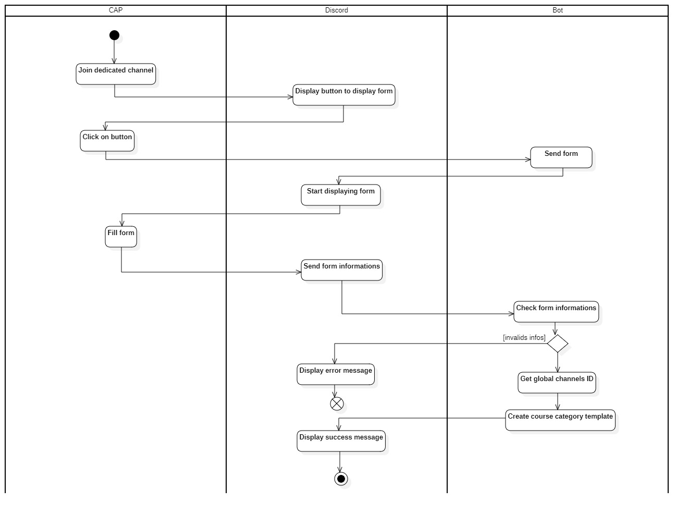

Ce présent diagramme décrit les activités possibles lors de la création d'une nouvelle formation : 

Un **CAP** rejoint le canal dédié à la création d'une formation, **Discord** affiche donc un bouton afin de d'afficher au **CAP** une interface de création de formation.
Le **CAP** clique sur le bouton et entre les différentes caractéristiques de la formation puis valide la demande de création d'une formation.
Le **Bot** vérifie les informations entrées par le **CAP**, si une erreur est detectée, il le notifie au **CAP**, sinon il récupère les IDs des canaux globaux prévus pour servir de canaux de templates, puis il créer un template de formation.
Enfin **Discord** va notifier le succès de la création de la formation au **CAP**

- Création d'une nouvelle promotion 

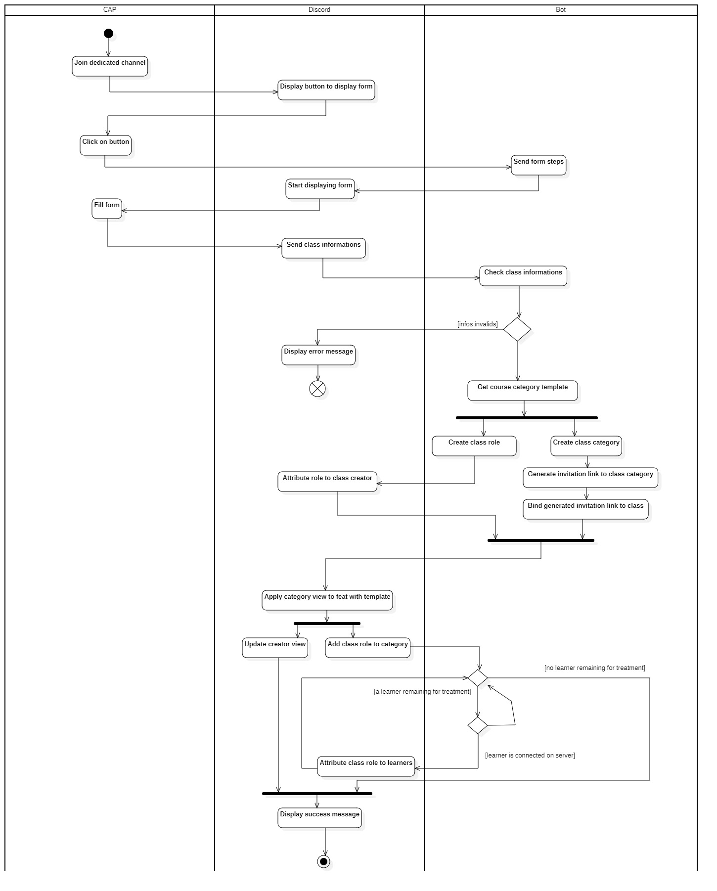

Ce présent diagramme décrit les activités possibles lors de la création d'une nouvelles promotions :

Un **CAP** rejoint le canal dédié à la création d'une promotion, **Discord** affiche donc un bouton afin de donner au **CAP** une interface de création de promotion.
Le **CAP** clique sur le bouton et entre les différentes caractéristiques de la promotion puis valide la demande de création de promotion.
Le **Bot** vérifie les informations entrées par le **CAP**, si une erreur est detectée, il le notifie au **CAP¨**, sinon le **Bot** récupère le template du type de formation,
puis il créer un rôle de promotion ainsi qu'une catégorie (un espace) dédié à la promotion à laquelle il lie un lien d'invitation.
Il attribue le rôle de promotion au **CAP** qui a crée la promotion.
Alors **Discord** applique le template de formation à la catégorie de la promotion et lie le rôle de promotion à la catégorie.
Ensuite le **Bot** va lié le rôle de promotion à chaque apprenant.
Enfin **Discord** va notifier le succès de la création de la promotion au **CAP**

- Utilisateur rejoignant le serveur

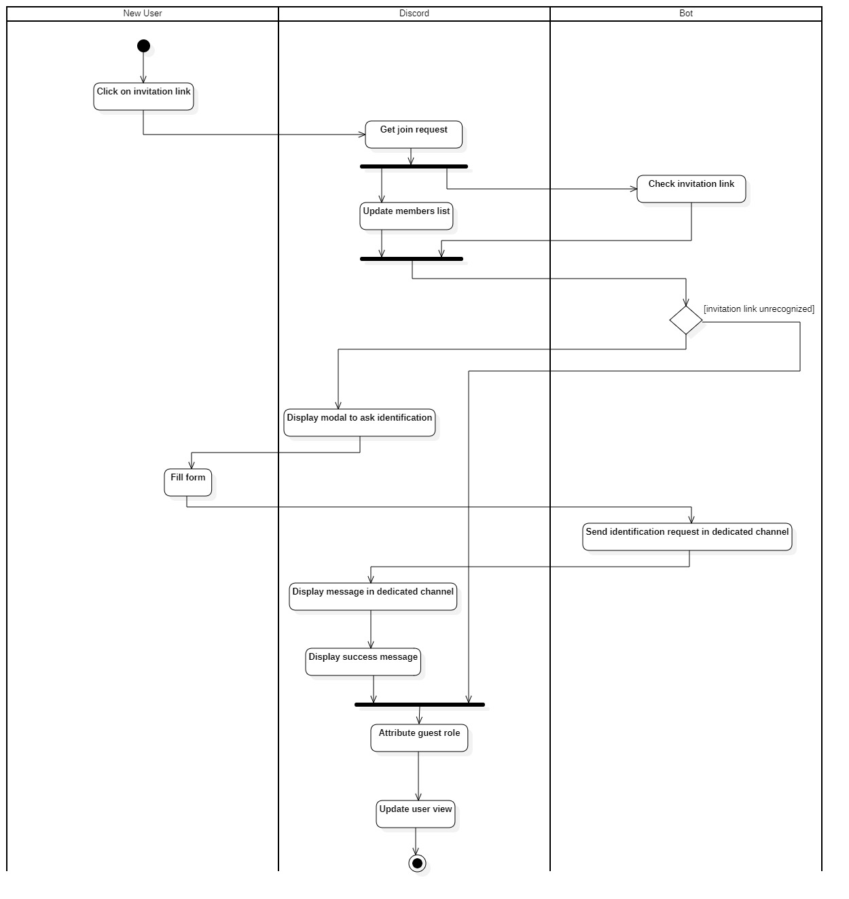

Ce présent diagramme décrit les activités possibles lorsce qu'un **nouvel utilisateur** rejoint le serveur **Discord**

Le **Nouvel utilisateur** clique sur le lien d'invitation
**Discord** récupère une demande d'entrer sur le serveur, il met alors à jour sa liste de membres.
Le **Bot** vérifie alors le lien d'invitation afin de determiner si le lien à un rôle associé ou non, si le lien n'a pas de rôle associé alors il attribue le rôle **Invité**
sinon, **Discord** affiche un formulaire sous forme de Pop-up afin de permettre au **Nouvel utilisateur** de s'identifier, à l'issue du remplissage de ce formulaire d'identification, le **Bot** envoi un message dans le canal dédié aux vérifications d'identités puis **Discord** affiche le message et envoi un message afin de notifier la prise en compte de sa demande d'identification au **Nouvel utilisateur**.
Enfin **Discord** attribue le rôle **Invité** au **Nouvel utilisateur** le temps que la demande d'identification de ce dernier soit acceptée.

- Consultation des demandes d'identifications

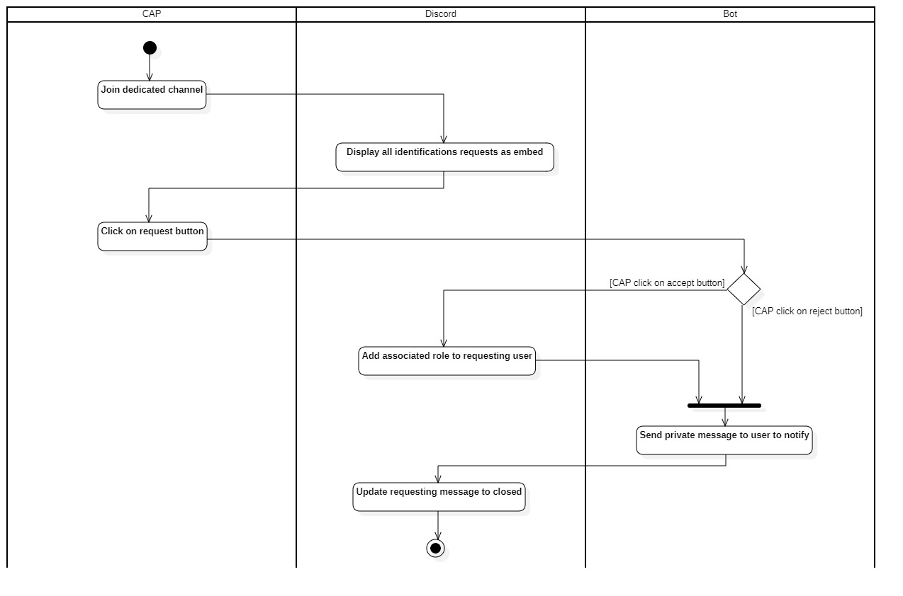

Ce présent diagramme décrit les activités possibles lorsce qu'un **CAP** veut consulter valider ou refuser une demande d'identification

Le **CAP** rejoint le canal prévu à cet effet, **Discord** renvoi alors toutes les demandes d'identifications des **nouveaux utilisateurs**.
Le **CAP** clique alors sur l'un des deux boutons (**Accepter** ou **Refuser**).
Le **Bot** analyse si le **CAP** à cliquer sur **Accepter**, alors, il attribue le rôle associé au lien d'invitation avec lequel l'utilisateur à rejoint le serveur **Discord** et notifie le **nouvel utilisateur** que sa demande d'identification à été acceptée.
Si le **CAP** à cliquer sur le bouton **Refuser** il notifie simplement au **nouvel utilisateur** que sa demande d'identification à été refusée.
Enfin **Discord** passe la demande d'identification en état **Fermée** afin de désactiver les intéractions avec la demande d'identification.

- Selection des promotions à afficher ou non 

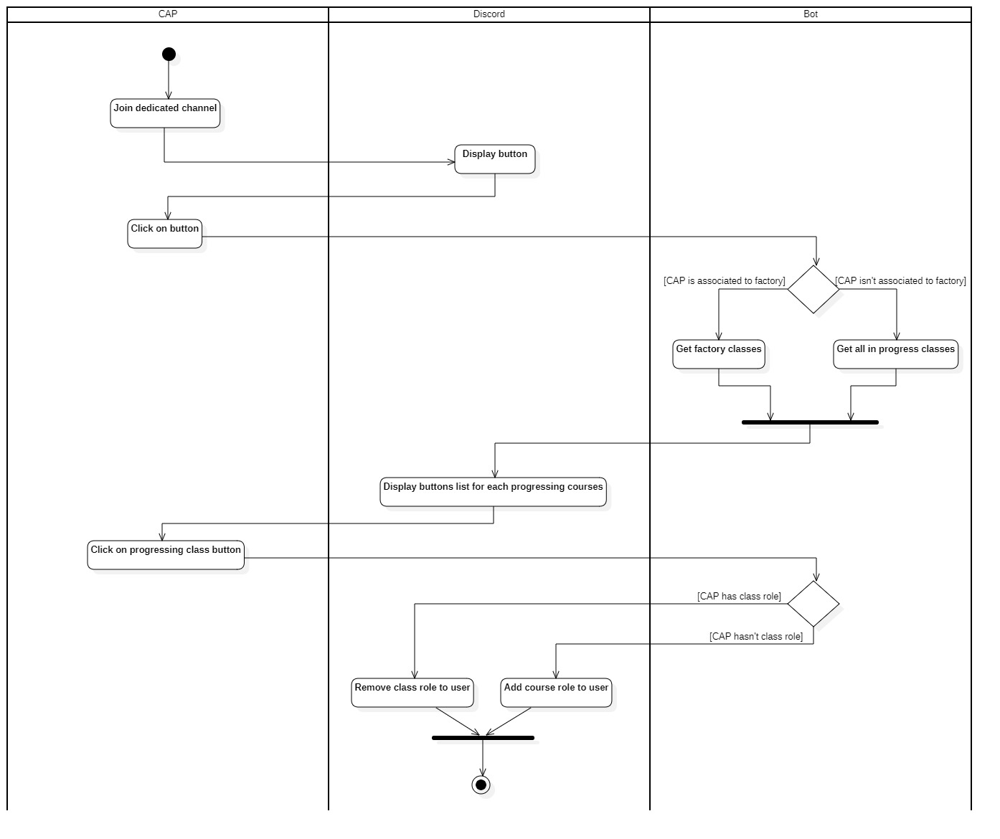

Ce présent diagramme décrit les activités possibles lorsce qu'un **CAP** veut selectionner une promotion à voir ou non

Le **CAP** rejoint le canal prévu à cet effet, **Discord** affiche alors un bouton sur lequel le **CAP** clique.
Le **Bot** analyse si le **CAP** s'est affilié à une **Fabrique** lors de son identification, si c'est le cas,
le **Bot** récupère toutes les promotions affiliées à la **Fabrique**, si ce n'est pas le cas alors il récupère,
toutes les promotions en cours puis demande à **Discord** d'afficher un bouton pour chaque promotion récupérée.

Le **CAP** clique sur le bouton d'une promotion, le **Bot** vérifie alors si le **CAP** a déjà le rôle de la
promotion, si c'est le cas, il lui retire ce qui a pour effet de désactiver l'affichage de l'espace de promotion.
Si ce n'est pas le cas, le **Bot** ajoute le rôle de la promotion au **CAP** ce qui a pour effet d'afficher
l'espace de promotion.

- Configuration du bot par un **Administrateur** 
  
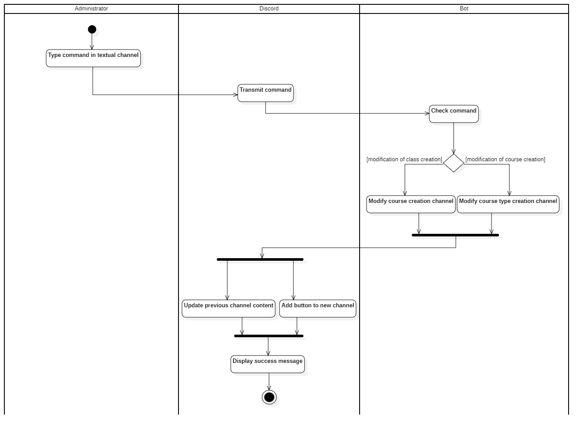

Ce présent diagramme décrit les activités possibles lorsce qu'un **Administrateur** veut configurer le bot

**L'administrateur** tape une commande dans un canal (peu importe le quel), **Discord** transmet la commande au **Bot**,
Le **Bot** vérifie la commande entrée, s'il s'agit d'une commande pour modifier le canal pour la création des promotions, alors il modifie cette entrée dans sa configuration
sinon, il modifie l'entrée pour la création de formation.
Ensuite **Discord** nettoie le précedent canal et affiche l'interface liée à la commande dans le canal spécifié dans la commande.
Enfin **Discord** affiche un message de succès à **l'administrateur**

###### Diagramme de séquences

Le diagramme de séquence représente les différentes activités d'une application de façon très détaillée, il est conçu à partir du <a href='#activities-diagram'>**diagramme d'activités**</a>

- Création d'une nouvelle formation  

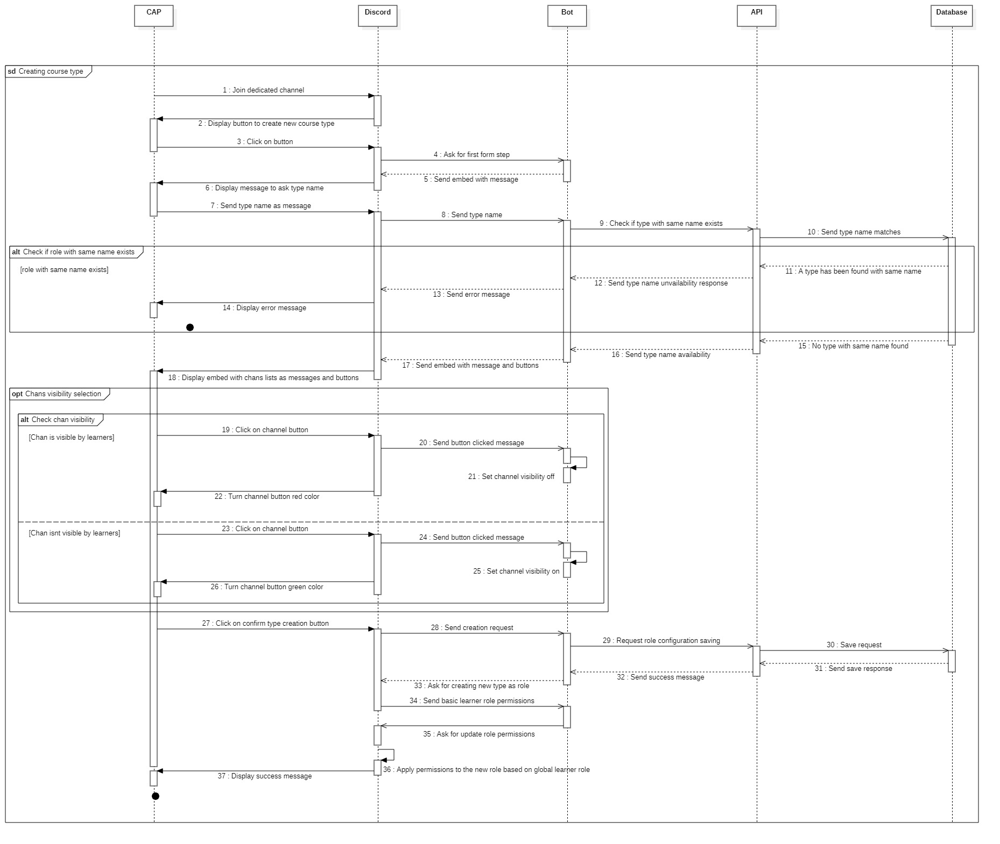

- Création d'une nouvelle promotion 

- Utilisateur rejoignant le serveur 

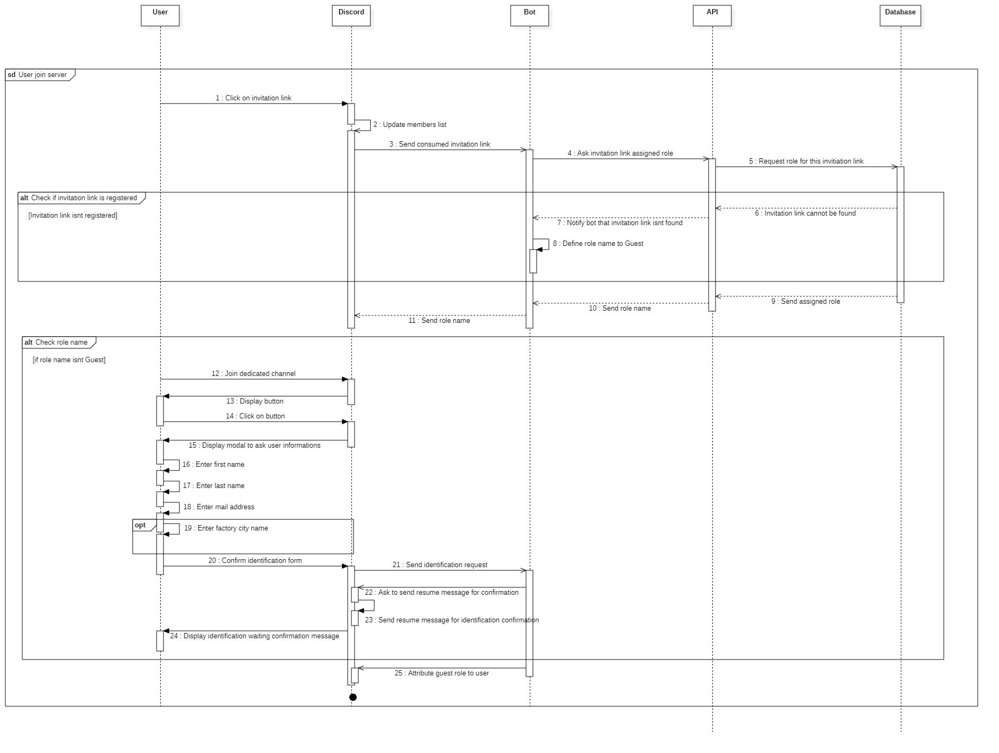

- Consultation des demandes d'identifications 

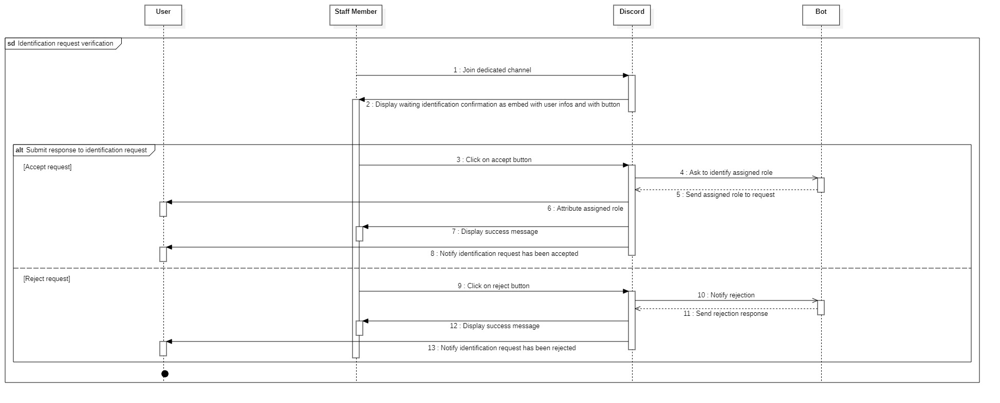

- Selection des promotions à afficher ou non 

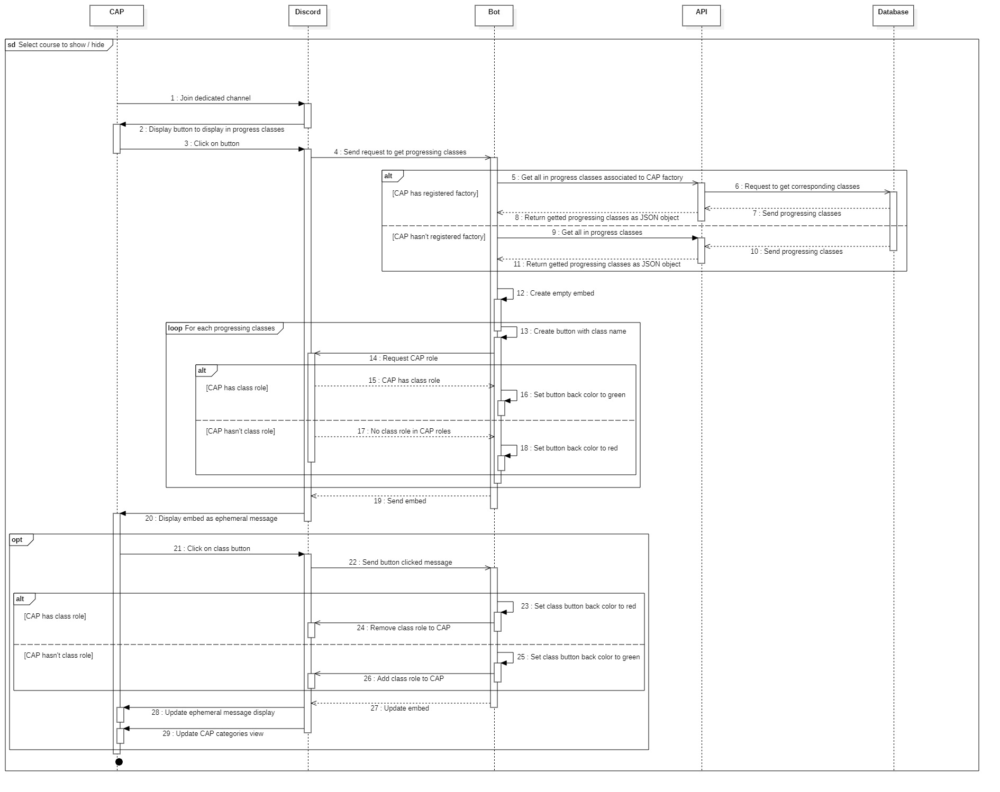

- Configuration du bot par un **Administrateur** 

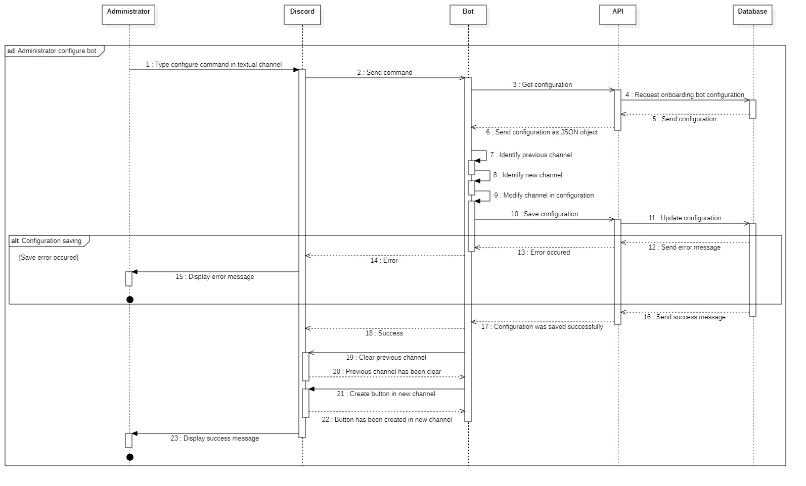

###### Diagramme de classes 

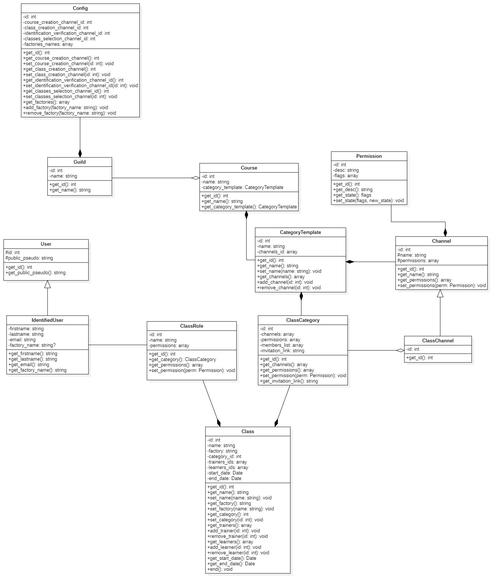

Dans ce diagramme nous avons une classe nommé **Config** qui est utile afin de configurer le **Bot**, elle compose la classe **Guild**
qui représente le **Serveur Discord** qui aggrege une la classe **Course** qui représente une formation.

La classe **CategoryTemplate** compose cette même classe **Course** et représente la façon dont doit-être agencé une **catégorie Discord** selon son type de **Course** (Formation)
La classe **Course** représente une formation
La classe **ClassCategory** compose la classe **CategoryTemplate** et est l'instanciation de la classe **CategoryTemplate**
La classe **ClassCategory** aggrère la classe **ClassChannel** qui est  l'instanciation des canaux pour la promotion
La classe **ClassChannel** généralise (hérite) de la classe **Channel** qui est la représentation d'un **canal Discord**
La classe **Permission** compose la classe **Channel**, cette classe permet de définir les permissions des différents rôles selon le **canal Discord**
La classe **ClassCategory** compose la classe **Class** qui représente une promotion dans son ensemble
La classe **ClassRole** compose elle aussi la classe **Class**, elle représente le rôle associé à chaque promotion
La classe **ClassRole** est associé à la classe **IdentifiedUser** qui représente un utilisateur identifié sur le **serveur Discord**
La classe **IdentifiedUser** généralise (hérite) **User** qui représente un utilisateur lambda

###### Sécurite du Bot Onboarding

Pour la sécurité du Bot, Discord met nativement en place un système d'authentification avec JWT (JSON Web Token) qui permet d'authentifier un système ou un utilisateur selon le contexte, de cette façon, Discord s'assure qu'une entité communiquant avec son API est authentifié.

De plus, le Bot d'Onboarding est déployé sur un serveur différent de l'API au sein d'un conteneur Docker, ce qui fait que si le Bot devenait vulnérable, les attaquants ne serait en mesure d'affecter les performances ou le comportement uniquement du Bot, et non pas du reste du Back-End, comme l'API qui est un point sensible en terme d'accès aux données.

Le Bot d'Onboarding est en quelques sortes isolés car il est exposé aux utilisateurs et donc plus vulnérables que l'API qui n'est exposé qu'aux Bots.

##### Deploiement du Back-End

###### Docker

Docker est un système permettant de créer des conteneurs afin d'éxecuter des environnements d'éxecution voire des systèmes d'exploitation.

Un conteneur docker est à l'instar d'une machine virtuelle, complétement isolé de l'environnement d'éxecution hôte.
Un conteneur n'est PAS une machine virtuelle ! 
Pour expliquer brièvement ce qu'est un conteneur Docker un schéma vaudra mieux que des mots : 

Dans ce schéma, on peut voir que les conteneurs Docker utilisent le système Hôte, le système utilisé pour lancer Docker, notez qu'il est techniquement possible de lancer un conteneur Docker avec un système d'exploitation différent de celui de l'hôte, mais que cela n'est pas recommandé en plus d'être inadapté pour les conteneurs.

Un conteneur puis-ce qu'il n'utilise pas de système d'exploitation différent de celui de l'hôte ne pèsent presque rien en comparaison d'une machine virtuelle qui doit elle s'occuper de maintenir un système d'exploitation, ce qui influe directement sur l'allocation des ressources.

Un conteneur Docker est un environnement dans lequel un développeur va installer certains environnement d'execution utile au programme qu'il cherche à executer, dans notre cas, nous avons des conteneurs avec l'environnement NodeJS en guise d'image de base, afin de permettre l'execution de notre application dans des conteneurs.

Nous avons choisi de conteneuriser chaques modules de l'application afin de permettre un déploiement simple et fluide, aussi, grace à Docker nous isolons chaque module dans des environnements d'execution différents.