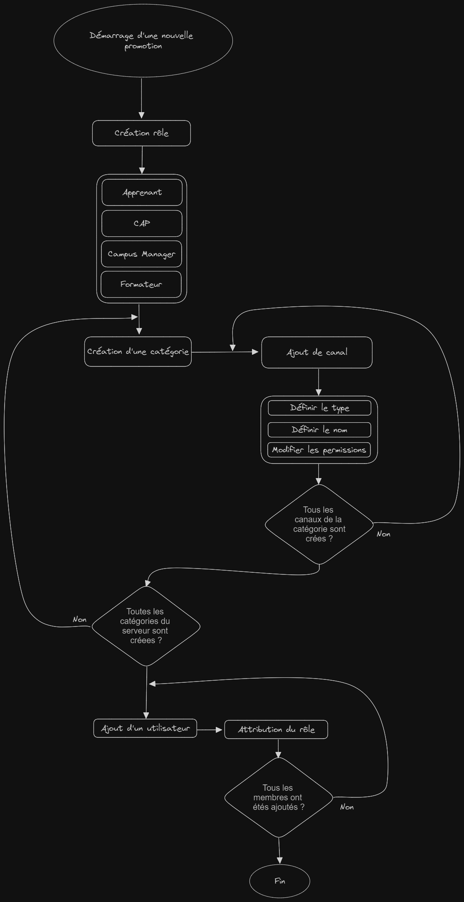

# Spécifications fonctionnelles

## Recueil du besoin client 

Pour recueillir les besoins du client, notre équipe a d'abord discuté avec les différents membres des équipes Simplon.
Suite à ces discussions, nous avons été en mesure d'établir une liste des problèmes les plus fréquemment rencontrés par les membres des équipes Simplon.

<table>
    <tr>
        <td>Problématiques</td>
        <td>Problèmes</td>
    </tr>
    <tr>
        <td rowspan="4">Utilisation inappropriée de Discord dans un cadre professionnel</td>
        <td>Multiplicité des supports de communication</td>
    </tr>
    <tr>
        <td>Mauvaise identification lors des interactions</td>
    </tr>
    <tr>
        <td>Actions répétitives du personnel</td>
    </tr>
    <tr>
        <td>Manque d'ergonomie de Discord</td>
    </tr>
    <tr>
        <td rowspan="4">Communication inefficace</td>
        <td>Multiplicité des messages inutiles (FLOOD)</td>
    </tr>
    <tr>
        <td>Perte de contact avec les anciens apprenants</td>
    </tr>
    <tr>
        <td>Pas de mentorat</td>
    </tr>
    <tr>
        <td>Problème de sourcing</td>
    </tr>
</table>

### Utilisation inappropriée de Discord dans un cadre professionnel

#### Multiplicité des supports de communication

Concernant ce problème, nos équipes ont compris que pour les membres de Simplon, il existe une multitude de serveurs Discord permettant de discuter avec différentes entités.
Il y a notamment 12 serveurs Discord sur une période d'un an et demi pour un formateur, en ne comptant que les serveurs réservés aux promotions concernant ce formateur et non les serveurs nécessaires au formateur pour discuter avec les membres des équipes Simplon.

#### Mauvaise identification lors des interactions

Discord met nativement en place un système de pseudonymes, ce qui n'est pas adapté à une utilisation professionnelle, où les membres d'une organisation ont besoin d'être identifiables. Cela peut entraîner des complications concernant l'identification des utilisateurs avec lesquels nous sommes amenés à discuter via Discord.

#### Actions répétitives du personnel

Il a également été remarqué que les membres des équipes Simplon, notamment les formateurs, effectuent un nombre considérable d'actions répétitives.
Par exemple, lors du démarrage d'une nouvelle promotion chez Simplon HDF, voici ce qu'un formateur doit faire pour permettre aux apprenants de discuter entre eux :

Et cela doit être répété pour chaque nouvelle promotion dont le formateur a la charge.

#### Manque d'ergonomie de Discord

Les membres des équipes nous ont avoué ne pas se sentir très à l'aise avec l'utilisation de Discord, notamment dans un contexte professionnel. En effet, son utilisation présente des lacunes ergonomiques.

### Communication inefficace

#### Multiplicité des messages inutiles

Il a également été remarqué une tendance chez les apprenants à envoyer des messages de rappel aux membres du staff dans des scénarios où ces derniers

n'ont pas reçu de réponse à leurs sollicitations. Cela peut sembler anodin, mais cela entraîne des messages inutiles ainsi que des distractions pour les membres des équipes.

#### Perte de contact avec les anciens apprenants

Certains membres des équipes Simplon nous ont interpellés quant à la perte de contact avec les anciens apprenants. En effet, dans la configuration actuelle de l'organisme de formation, il n'existe pas de réelle solution permettant de garder le contact avec les anciens apprenants. Une fois leur formation terminée, ils quittent le serveur Discord attribué à leur promotion, ce qui le rend inutilisé.

#### Problème de sourcing

Les membres ont également signalé des problèmes de sourcing. Selon eux, il est relativement compliqué de remplir les promotions avec des profils correspondant aux critères de ces promotions.

## Règles de gestion 

Les règles de gestion sont une suite de règles que les membres d'une équipe définissent pour répartir les possibilités et les devoirs des entités constituant un système. Suite au recueil des besoins du client, notre équipe a établi les règles de gestion du projet.

- Le bot doit disposer d'un système de configuration.
  - Le bot doit avoir une commande de génération d'embed (dans un canal) pour l'ajout des membres du staff.
    - L'embed doit disposer d'une liste déroulante permettant de sélectionner le rôle et de générer un lien d'invitation.
  - Le bot doit avoir une commande de génération d'embed (dans un canal) pour la création d'un nouveau type de formation.
    - L'embed doit disposer d'un bouton permettant d'envoyer une demande de nom pour le nouveau type de formation.
- Le bot doit avoir une commande de génération d'embed (dans un canal) pour l'ajout de formations.
  - L'embed doit disposer d'une liste déroulante permettant la sélection du type de formation.
    - Une demande doit être envoyée pour demander de compléter le nom de la formation.
    - Un nouvel embed doit être envoyé avec un bouton permettant de créer une nouvelle formation.
    - Le bot doit envoyer un message demandant la date de début et de fin de la formation.
- Le bot doit avoir une commande de génération d'embed (dans un canal) pour l'ajout d'apprenants à une formation.
  - L'embed doit disposer d'une liste déroulante permettant de générer un lien d'invitation pour un nouvel apprenant, pour une formation spécifique.
    - Le lien d'invitation doit être valide pour une seule personne.
- Le bot doit avoir une commande de génération d'embed (dans un canal) pour l'ajout de nouveaux utilisateurs déjà présents sur le serveur Discord, à une formation.
  - L'embed doit disposer d'une liste déroulante permettant de sélectionner une formation spécifique.
    - Lors de la sélection de la formation, un nouvel embed doit être envoyé, avec un bouton permettant d'afficher un formulaire d'ajout d'utilisateur.
- Le bot doit avoir une commande de génération d'embed (dans un canal) pour l'ajout ou la modification de modèles de catégories de formation.
  - Une catégorie de formation est un ensemble de canaux dédiés à une formation.
  - Lors de la création d'une formation, le bot doit générer un embed de configuration dans un canal propre à sa catégorie.
- Le lien d'invitation généré par le bot ne doit fonctionner que pour une personne.
- Le lien d'invitation doit être temporaire.
- Le bot ne doit pas pouvoir créer deux fois le même embed de configuration.
- Le bot doit pouvoir détecter si un embed a été supprimé pour permettre la création d'un nouveau.
- L'administrateur peut supprimer un embed.

- Lors de l'ajout d'un utilisateur à une formation, le bot doit envoyer une demande de vérification (dans un canal dédié à cette formation).
- Le bot doit exiger une identification lors de l'arrivée d'un nouvel apprenant ou d'un nouveau membre du staff.
  - Lors de l'arrivée d'un nouvel apprenant, le bot doit envoyer un message de demande de vérification (dans un canal dédié à cette formation).
  - Lors de l'arrivée d'un nouveau membre du staff, le bot doit envoyer un message de demande de vérification (dans un canal dédié au staff).
    - Une fois l'identité vérifiée, le rôle doit être attribué par le bot à l'utilisateur du lien.
- Le bot doit mettre en place un embed (dans un canal) permettant de sélectionner les formations visibles pour le staff.

## RBAC (Role Based Access Control) 

Le RBAC est un système conceptuel qui suit le principe du moindre privilège en matière de sécurité. Grâce au RBAC, il est possible de définir les permissions des utilisateurs d'un système en fonction de leur rôle, un rôle étant lui-même défini par d'autres critères tels que les fonctions et les tâches d'un utilisateur, par exemple.

| Permissions                                                   	| Administrateur 	| Directeur 	| Staff Simplon 	| Campus-manager 	| Caps 	| Formateur 	| Bots discord 	| Apprenant 	| Formation rôle 	| Promotion rôle 	| Développeur 	| Alumnis 	| Noob 	| Everyone 	|
|---------------------------------------------------------------	|:--------------:	|:---------:	|:-------------:	|:--------------:	|:----:	|:---------:	|:------------:	|:---------:	|:--------------:	|:--------------:	|:-----------:	|:-------:	|:----:	|:--------:	|
|                     **Permission discord**                    	|                	|           	|               	|                	|      	|           	|              	|           	|                	|                	|             	|         	|      	|          	|
| Voir les salons                                               	|        ✅       	|     ✅     	|       ✅       	|        ✅       	|   ✅  	|     ✅     	|       ✅      	|     ✅     	|        ✅       	|        ✅       	|      ✅      	|    ✅    	|   ✅  	|     ❌    	|
| Gérer les salons                                              	|        ✅       	|     ✅     	|       ✅       	|        ✅       	|   ❌  	|     ✅     	|       ✅      	|     ❌     	|        ❌       	|        ❌       	|      ❌      	|    ❌    	|   ❌  	|     ❌    	|
| Gérer les rôles                                               	|        ✅       	|     ✅     	|       ✅       	|        ✅       	|   ❌  	|     ❌     	|       ✅      	|     ❌     	|        ❌       	|        ❌       	|      ❌      	|    ❌    	|   ❌  	|     ❌    	|
| Gérer les émojis et autocollant                               	|        ✅       	|     ✅     	|       ✅       	|        ✅       	|   ❌  	|     ❌     	|       ✅      	|     ❌     	|        ❌       	|        ❌       	|      ❌      	|    ❌    	|   ❌  	|     ❌    	|
| Voir les logs du serveur                                      	|        ✅       	|     ✅     	|       ✅       	|        ✅       	|   ❌  	|     ❌     	|       ✅      	|     ❌     	|        ❌       	|        ❌       	|      ❌      	|    ❌    	|   ❌  	|     ❌    	|
| Voir les analyses de serveur                                  	|        ✅       	|     ✅     	|       ✅       	|        ✅       	|   ✅  	|     ❌     	|       ✅      	|     ❌     	|        ❌       	|        ❌       	|      ❌      	|    ❌    	|   ❌  	|     ❌    	|
| Gérer les webhooks                                            	|        ✅       	|     ✅     	|       ✅       	|        ✅       	|   ❌  	|     ✅     	|       ✅      	|     ❌     	|        ❌       	|        ❌       	|      ❌      	|    ❌    	|   ❌  	|     ❌    	|
| Gérer le serveur                                              	|        ✅       	|     ✅     	|       ✅       	|        ✅       	|   ❌  	|     ❌     	|       ✅      	|     ❌     	|        ❌       	|        ❌       	|      ❌      	|    ❌    	|   ❌  	|     ❌    	|
|                  **Permissions des membres**                  	|                	|           	|               	|                	|      	|           	|              	|           	|                	|                	|             	|         	|      	|          	|
| Crée une invitation                                           	|        ✅       	|     ✅     	|       ✅       	|        ✅       	|   ❌  	|     ❌     	|       ✅      	|     ❌     	|        ❌       	|        ❌       	|      ❌      	|    ❌    	|   ❌  	|     ❌    	|
| Changer le pseudo                                             	|        ✅       	|     ✅     	|       ✅       	|        ✅       	|   ✅  	|     ✅     	|       ✅      	|     ❌     	|        ❌       	|        ❌       	|      ✅      	|    ✅    	|   ✅  	|     ❌    	|
| Gérer les pseudos                                             	|        ✅       	|     ✅     	|       ✅       	|        ✅       	|   ✅  	|     ❌     	|       ✅      	|     ❌     	|        ❌       	|        ❌       	|      ❌      	|    ❌    	|   ❌  	|     ❌    	|
| Expulser des membres                                          	|        ✅       	|     ✅     	|       ✅       	|        ✅       	|   ✅  	|     ❌     	|       ✅      	|     ❌     	|        ❌       	|        ❌       	|      ❌      	|    ❌    	|   ❌  	|     ❌    	|
| Bannir des membres                                            	|        ✅       	|     ✅     	|       ✅       	|        ✅       	|   ✅  	|     ❌     	|       ✅      	|     ❌     	|        ❌       	|        ❌       	|      ❌      	|    ❌    	|   ❌  	|     ❌    	|
| Exclure temporaorement des membres                            	|        ✅       	|     ✅     	|       ✅       	|        ✅       	|   ✅  	|     ❌     	|       ✅      	|     ❌     	|        ❌       	|        ❌       	|      ❌      	|    ❌    	|   ❌  	|     ❌    	|
|                **Permissions de salon textuel**               	|                	|           	|               	|                	|      	|           	|              	|           	|                	|                	|             	|         	|      	|          	|
| Envoyer des messages                                          	|        ✅       	|     ✅     	|       ✅       	|        ✅       	|   ✅  	|     ✅     	|       ✅      	|     ❌     	|        ❌       	|        ❌       	|      ✅      	|    ✅    	|   ✅  	|     ❌    	|
| Envoyer des messages dans les fils                            	|        ✅       	|     ✅     	|       ✅       	|        ✅       	|   ✅  	|     ✅     	|       ✅      	|     ❌     	|        ❌       	|        ❌       	|      ✅      	|    ✅    	|   ✅  	|     ❌    	|
| Créer des fils publics                                        	|        ✅       	|     ✅     	|       ✅       	|        ✅       	|   ✅  	|     ✅     	|       ✅      	|     ✅     	|        ✅       	|        ✅       	|      ✅      	|    ✅    	|   ✅  	|     ❌    	|
| Créer des fils privés                                         	|        ✅       	|     ✅     	|       ✅       	|        ✅       	|   ✅  	|     ✅     	|       ✅      	|     ❌     	|        ❌       	|        ❌       	|      ❌      	|    ❌    	|   ❌  	|     ❌    	|
| Intégrer des liens                                            	|        ✅       	|     ✅     	|       ✅       	|        ✅       	|   ✅  	|     ✅     	|       ✅      	|     ✅     	|        ✅       	|        ✅       	|      ✅      	|    ✅    	|   ✅  	|     ❌    	|
| Joindre des fichiers                                          	|        ✅       	|     ✅     	|       ✅       	|        ✅       	|   ✅  	|     ✅     	|       ✅      	|     ✅     	|        ✅       	|        ✅       	|      ✅      	|    ✅    	|   ✅  	|     ❌    	|
| Ajouter des réactions                                         	|        ✅       	|     ✅     	|       ✅       	|        ✅       	|   ✅  	|     ✅     	|       ✅      	|     ✅     	|        ✅       	|        ✅       	|      ✅      	|    ✅    	|   ✅  	|     ❌    	|
| Utiliser des émojis externes                                  	|        ✅       	|     ✅     	|       ✅       	|        ✅       	|   ✅  	|     ✅     	|       ✅      	|     ✅     	|        ✅       	|        ✅       	|      ✅      	|    ✅    	|   ✅  	|     ❌    	|
| Mentionner everyone, here et tous les rôles                   	|        ✅       	|     ✅     	|       ✅       	|        ✅       	|   ✅  	|     ❌     	|       ✅      	|     ❌     	|        ❌       	|        ❌       	|      ❌      	|    ❌    	|   ❌  	|     ❌    	|
| Gérer les messages                                            	|        ✅       	|     ✅     	|       ✅       	|        ✅       	|   ✅  	|     ✅     	|       ✅      	|     ❌     	|        ❌       	|        ❌       	|      ❌      	|    ❌    	|   ❌  	|     ❌    	|
| Gérer les fils                                                	|        ✅       	|     ✅     	|       ✅       	|        ✅       	|   ✅  	|     ✅     	|       ✅      	|     ❌     	|        ❌       	|        ❌       	|      ❌      	|    ❌    	|   ❌  	|     ❌    	|
| Voir les anciens messages                                     	|        ✅       	|     ✅     	|       ✅       	|        ✅       	|   ✅  	|     ✅     	|       ✅      	|     ✅     	|        ✅       	|        ✅       	|      ✅      	|    ✅    	|   ✅  	|     ❌    	|
| Envoyer des message de synthése vocale (tts)                  	|        ❌       	|     ❌     	|       ❌       	|        ❌       	|   ❌  	|     ❌     	|       ❌      	|     ❌     	|        ❌       	|        ❌       	|      ❌      	|    ❌    	|   ❌  	|     ❌    	|
| Utiliser les commandes de l'application                       	|        ✅       	|     ✅     	|       ✅       	|        ✅       	|   ✅  	|     ✅     	|       ✅      	|     ✅     	|        ✅       	|        ✅       	|      ✅      	|    ✅    	|   ✅  	|     ❌    	|
|                 **Permission de salon vocal**                 	|                	|           	|               	|                	|      	|           	|              	|           	|                	|                	|             	|         	|      	|          	|
| Se connecter                                                  	|        ✅       	|     ✅     	|       ✅       	|        ✅       	|   ✅  	|     ✅     	|       ✅      	|     ✅     	|        ✅       	|        ✅       	|      ✅      	|    ✅    	|   ✅  	|     ❌    	|
| Parler                                                        	|        ✅       	|     ✅     	|       ✅       	|        ✅       	|   ✅  	|     ✅     	|       ✅      	|     ✅     	|        ✅       	|        ✅       	|      ✅      	|    ✅    	|   ✅  	|     ❌    	|
| Vidéo                                                         	|        ✅       	|     ✅     	|       ✅       	|        ✅       	|   ✅  	|     ✅     	|       ✅      	|     ✅     	|        ✅       	|        ✅       	|      ✅      	|    ✅    	|   ✅  	|     ❌    	|
| Utiliser les activités                                        	|        ✅       	|     ✅     	|       ✅       	|        ✅       	|   ✅  	|     ✅     	|       ✅      	|     ✅     	|        ✅       	|        ✅       	|      ✅      	|    ✅    	|   ✅  	|     ❌    	|
| Utiliser la détection de voix                                 	|        ✅       	|     ✅     	|       ✅       	|        ✅       	|   ✅  	|     ✅     	|       ✅      	|     ✅     	|        ✅       	|        ✅       	|      ✅      	|    ✅    	|   ✅  	|     ❌    	|
| Voix prioritaire                                              	|        ✅       	|     ✅     	|       ✅       	|        ✅       	|   ✅  	|     ✅     	|       ✅      	|     ❌     	|        ❌       	|        ❌       	|      ❌      	|    ❌    	|   ❌  	|     ❌    	|
| Rendre les membres muet                                       	|        ✅       	|     ✅     	|       ✅       	|        ✅       	|   ✅  	|     ✅     	|       ✅      	|     ❌     	|        ❌       	|        ❌       	|      ❌      	|    ❌    	|   ❌  	|     ❌    	|
| Mettre en sourdine des membres                                	|        ✅       	|     ✅     	|       ✅       	|        ✅       	|   ✅  	|     ✅     	|       ✅      	|     ❌     	|        ❌       	|        ❌       	|      ❌      	|    ❌    	|   ❌  	|     ❌    	|
| Déplacer des membres                                          	|        ✅       	|     ✅     	|       ✅       	|        ✅       	|   ✅  	|     ✅     	|       ✅      	|     ❌     	|        ❌       	|        ❌       	|      ❌      	|    ❌    	|   ❌  	|     ❌    	|
|               **Permission de salon conférence**              	|                	|           	|               	|                	|      	|           	|              	|           	|                	|                	|             	|         	|      	|          	|
| Demande de prise de parole                                    	|        ✅       	|     ✅     	|       ✅       	|        ✅       	|   ✅  	|     ✅     	|       ✅      	|     ✅     	|        ✅       	|        ✅       	|      ✅      	|    ✅    	|   ✅  	|     ✅    	|
|                 **Permission des événements**                 	|                	|           	|               	|                	|      	|           	|              	|           	|                	|                	|             	|         	|      	|          	|
| Gérer les évenements                                          	|        ✅       	|     ✅     	|       ✅       	|        ✅       	|   ✅  	|     ✅     	|       ✅      	|     ❌     	|        ❌       	|        ❌       	|      ❌      	|    ❌    	|   ❌  	|     ❌    	|
|                    **Permissions avancées**                   	|                	|           	|               	|                	|      	|           	|              	|           	|                	|                	|             	|         	|      	|          	|
| Administrateur                                                	|        ✅       	|     ✅     	|       ❌       	|        ❌       	|   ❌  	|     ❌     	|       ✅      	|     ❌     	|        ❌       	|        ❌       	|      ❌      	|    ❌    	|   ❌  	|     ❌    	|
|                         **Formations**                        	|                	|           	|               	|                	|      	|           	|              	|           	|                	|                	|             	|         	|      	|          	|
| Accès au salon de promotion                                   	|        ✅       	|     ✅     	|       ✅       	|        ✅       	|   ✅  	|     ✅     	|       ✅      	|     ❌     	|        ❌       	|        ✅       	|      ❌      	|    ❌    	|   ❌  	|     ❌    	|
|             **Configuration des différents bots**             	|                	|           	|               	|                	|      	|           	|              	|           	|                	|                	|             	|         	|      	|          	|
| Configuration du bot de onBoarding                            	|        ✅       	|     ✅     	|       ❌       	|        ❌       	|   ❌  	|     ❌     	|       ❌      	|     ❌     	|        ❌       	|        ❌       	|      ❌      	|    ❌    	|   ❌  	|     ❌    	|
| Configuration du bot de ticketing                             	|        ✅       	|     ✅     	|       ❌       	|        ❌       	|   ❌  	|     ❌     	|       ❌      	|     ❌     	|        ❌       	|        ❌       	|      ❌      	|    ❌    	|   ❌  	|     ❌    	|
| Configuration du bot de sondage                               	|        ✅       	|     ✅     	|       ❌       	|        ❌       	|   ❌  	|     ❌     	|       ❌      	|     ❌     	|        ❌       	|        ❌       	|      ❌      	|    ❌    	|   ❌  	|     ❌    	|
| Configuration du bot de feedback                              	|        ✅       	|     ✅     	|       ❌       	|        ❌       	|   ❌  	|     ❌     	|       ❌      	|     ❌     	|        ❌       	|        ❌       	|      ❌      	|    ❌    	|   ❌  	|     ❌    	|
| Configuration du bot SimplonHub                               	|        ✅       	|     ✅     	|       ❌       	|        ❌       	|   ❌  	|     ❌     	|       ❌      	|     ❌     	|        ❌       	|        ❌       	|      ❌      	|    ❌    	|   ❌  	|     ❌    	|
| Configuration du bot de modération                            	|        ✅       	|     ✅     	|       ❌       	|        ❌       	|   ❌  	|     ❌     	|       ❌      	|     ❌     	|        ❌       	|        ❌       	|      ❌      	|    ❌    	|   ❌  	|     ❌    	|
| Configuration du bot de mentorat                              	|        ✅       	|     ✅     	|       ❌       	|        ❌       	|   ❌  	|     ❌     	|       ❌      	|     ❌     	|        ❌       	|        ❌       	|      ❌      	|    ❌    	|   ❌  	|     ❌    	|
| Configuration du bot de sourcing                              	|        ✅       	|     ✅     	|       ❌       	|        ❌       	|   ❌  	|     ❌     	|       ❌      	|     ❌     	|        ❌       	|        ❌       	|      ❌      	|    ❌    	|   ❌  	|     ❌    	|
|            **Fonctionnalitées des différent bots**            	|                	|           	|               	|                	|      	|           	|              	|           	|                	|                	|             	|         	|      	|          	|
| **OnBoarding**                                                	|                	|           	|               	|                	|      	|           	|              	|           	|                	|                	|             	|         	|      	|          	|
| Générer un lien d'invitation staff                            	|        ✅       	|     ✅     	|       ❌       	|        ✅       	|   ✅  	|     ❌     	|       ✅      	|     ❌     	|        ❌       	|        ❌       	|      ❌      	|    ❌    	|   ❌  	|     ❌    	|
| Vérification de l'identité d'un nouveau membre                	|        ✅       	|     ✅     	|       ✅       	|        ✅       	|   ✅  	|     ❌     	|       ✅      	|     ❌     	|        ❌       	|        ❌       	|      ❌      	|    ❌    	|   ❌  	|     ❌    	|
| Création d'un nouveau type de promotion                       	|        ✅       	|     ✅     	|       ❌       	|        ✅       	|   ✅  	|     ❌     	|       ✅      	|     ❌     	|        ❌       	|        ❌       	|      ❌      	|    ❌    	|   ❌  	|     ❌    	|
| Création d'une nouvelle promotion                             	|        ✅       	|     ✅     	|       ❌       	|        ✅       	|   ✅  	|     ❌     	|       ✅      	|     ❌     	|        ❌       	|        ❌       	|      ❌      	|    ❌    	|   ❌  	|     ❌    	|
| Générer un lien d'invitation pour un nouvel apprenant         	|        ✅       	|     ✅     	|       ❌       	|        ✅       	|   ✅  	|     ❌     	|       ✅      	|     ❌     	|        ❌       	|        ❌       	|      ❌      	|    ❌    	|   ❌  	|     ❌    	|
| Ajout d'un membre déjà présent sur le discord a une formation 	|        ✅       	|     ✅     	|       ❌       	|        ✅       	|   ✅  	|     ❌     	|       ✅      	|     ❌     	|        ❌       	|        ❌       	|      ❌      	|    ❌    	|   ❌  	|     ❌    	|
| Modification de template de catégorie de formation            	|        ✅       	|     ✅     	|       ❌       	|        ✅       	|   ✅  	|     ❌     	|       ✅      	|     ❌     	|        ❌       	|        ❌       	|      ❌      	|    ❌    	|   ❌  	|     ❌    	|
| Sélection des formations visibles pour le staff               	|        ✅       	|     ✅     	|       ✅       	|        ✅       	|   ✅  	|     ❌     	|       ✅      	|     ❌     	|        ❌       	|        ❌       	|      ❌      	|    ❌    	|   ❌  	|     ❌    	|
| Modification de la catégories de sa promotion                 	|        ❌       	|     ❌     	|       ❌       	|        ❌       	|   ❌  	|     ✅     	|       ✅      	|     ❌     	|        ❌       	|        ❌       	|      ❌      	|    ❌    	|   ❌  	|     ❌    	|
