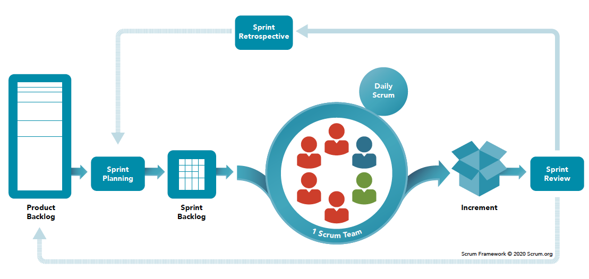
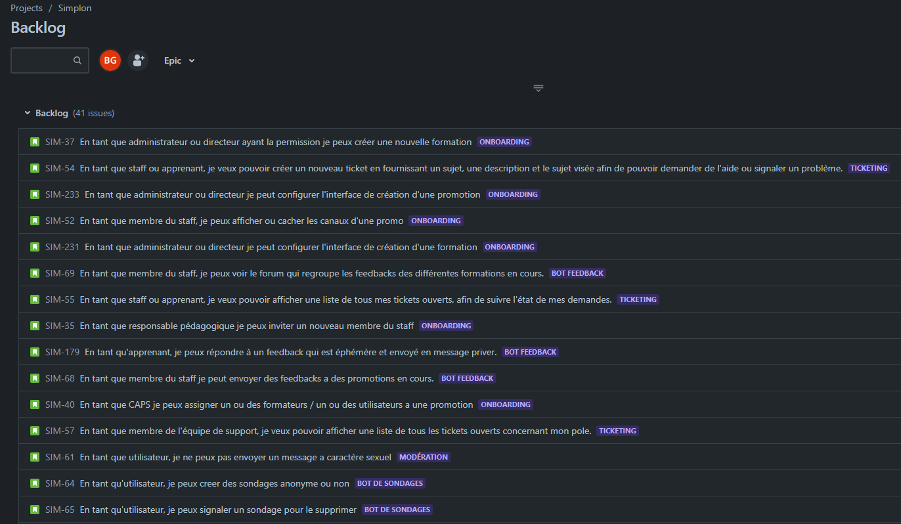

# Gestion du projet

Avant de démarrer un projet, il est important de se poser les bonnes questions, telles que la façon dont le projet devra être géré, quels objectifs le projet se fixe, et bien d'autres questions auxquelles mon équipe a tenté d'apporter des réponses les plus adaptées possible.

## Méthodologie de travail : Agile

La méthodologie Agile est une méthodologie itérative permettant le découpage des différents cycles de développement d'un projet en "sprint", chaque sprint à une durée moyenne d'1 à 4 semaines, à l'issue de ce sprint, une version fonctionnelle peut être présentée au client.

De plus, une équipe Agile intéragira de façon auto-gérée, au sein d'une équipe Agile, la collaboration se fait entre tous les membres de façon étroite, le partage des responsabilités est aussi un des aspects clés de cette méthodologie, cette proximité au sein de l'équipe Agile permet une communication continue. 

Agile apporte une livraison continue / itérative du produit au client, à chaque fin de sprint, le client peut récupérer une version du produit fonctionnelle et en tirer partie.

Les tâches d'un projet sont priorisées au sein d'un product Backlog selon la valeur ajoutée pour le client, il est nécessaire d'établir un product Backlog en priorisant les tâches à effectuer dès le début afin de permettre au client de tirer avantage au plus vite du produit.

Aussi, Agile considère que les besoins et les exigences du projet évoluent tout au long de la vie de ce dernier, avec Agile, l'équipe peut s'adapter à ces changements et effectuer des ajustements en fonction des nouvelles informations fournies par le client après qu'il ait reçu la dernière version fonctionnelle du produit.

Dû à ces délimitations des cycles de développement flexible, Agile permet à l'équipe de développement de s'améliorer de façon continue en mettant en place des rituels tels que les Sprint Review et les Sprint Retrospectives qui ont lieu à la fin de chaque sprint, permettant aux différents membres de l'équipe de discuter des succès et des difficultés rencontrées lors du dernier sprint.

De plus Agile inclut une métrique : La vélocité qui est recalculé à chaque fin de sprints, de cette façons les membres de l'équipes sont capables d'évalués la quantité de travail achevée lors du sprint.

### Framework SCRUM

SCRUM ou littéralement Mélée est un framework permettant aux équipes qui le mettent en place d'adopter une approche Agile et d'apporter de la flexibilité au projet.

Le framework SCRUM permet à chaque membre d'une équipe d'avoir un rôle à jouer dans la prise de décision concernant un projet.

La taille d'une équipe SCRUM peut varier, mais il est important de savoir que SCRUM est plus adaptée à des équipes à effectife réduite, en effet, à partir d'un certains nombre de membre, peu importe la méthodologie utilisé au sein d'une équipe, la communication devient de plus en plus complexe.

SCRUM se reposent sur 4 grandes valeurs et 12 principes

#### SCRUM : 4 Valeurs

##### Individus & Interaction > Processus & Outils

Une équipe engagée créer un produit de valeur estimable

##### Un produit fonctionnel > Une documentation exhaustive

La documentation d'un produit est essentielle, cependant une équipe doit se concentrer sur les fonctionnalités d'un produit plutôt que sur la rédaction d'une documentation.

##### Collaboration avec le client > Negociation contractuelle

Il est essentiel de placer le client au sein du processus de développement du produit, les retours du client sur le produit sont une source d'information précieuse, une bonne collaboration entre le client et l'équipe SCRUM permet l'élaboration d'un produit fini le plus fidèle aux exigences du client.

##### Adaptation au changement > Suivi d'un plan

Dans SCRUM l'apport de modifications aux projets n'est pas un obstacle, étant donné que le produit se construit de façon itérative, en plaçant le client au centre du processus de développement, il est plus facile pour les équipes d'effecuter des ajustements concernant le projet tout au long de ces cycles de développement, plutôt que d'avoir à revoir complétement certains aspects du produit à la fin du développement de ce dernier.

#### SCRUM : Les rôles

##### Product Owner

Le Product Owner est le responsable de la liaison entre le client et l'équipe de développement, son rôle est de comprendre le client et de retranscrir sa demande aux équipes de développement

Les tâches du Product Owner sont :

- De créer et gérer un Product Backlog en prennant en compte les tâches à prioriser.
- Collaborer avec les équipes afin de s'assurer que tous les membres comprennent le Product Backlog du projet.
- Fournit à l'équipe les prochaines fonctionnalités à livrer
- Décident de la durée des sprints

##### Le Scrum Master

Le Scrum Master est le membre responsable de l'application de SCRUM au sein de son équipe, il analyse perpetuellement les optimisations possible à apporter en terme d'application SCRUM au sein de son équipe, il s'assure de comprendre ce que l'équipe doit réaliser et aide celle-ci à optimiser la transparence du projet et le flux de livraison de ce dernier, il gère les ressources humaines et logistiques d'une équipe pour planifier les sprints.

Il organise les cérémonies SCRUM.

##### L'équipe de développement

L'équipe de développement est constitué de 5 à 7 développeurs la plupart du temps, ces développeurs travaillent en étroite collaboration, ce qui permet d'aider chaque membre de l'équipe de développement en difficulté afin de ne pas se retrouver avec un retard dans la livraison du produit à la fin du sprint.

##### La vélocité & SCRUM

La vélocité calculée à chaque fin de sprint permet au SCRUM Master de jauger la charge de travail à effectuer dans le prochain sprint.

#### SCRUM : Les rituels

##### Sprint Planning

Le Sprint Planning est organisé par le SCRUM Master afin d'établir la liste des User Stories à mettre dans le prochain sprint, l'équipe s'accorde à dire que toutes les User Stories sont en mesures d'être complétés à l'issue du sprint (notamment en se basant sur la vélocité calculée à la fin du dernier sprint)

##### Daily Scrum

Le Daily Scrum à lieu tous les jours, il s'agit d'une réunion d'une durée moyenne de 15 minutes qui permet à l'équipe de se remettre en phase avec les objectifs du Sprint en cours.

Les questions indicatives à se poser pour les membres de l'équipe afin d'établir s'il est en phase avec les objectifs sont : 

- Qu'est ce que j'ai fais hier ?
- Qu'est ce que je dois faire aujourd'hui ?
- Quels obstacles j'ai et je pourrai rencontrer ?

##### Sprint Review

La Sprint Review permet à l'équipe de présenter le travail réalisé lors du Sprint aux différentes parties prenantes, lors de cette réunion, le Product Owner peut décider de livrer ou non le travail réalisé.

Pour un Sprint d'une durée d'1 semaine envisagez 1 heure de Sprint Review

##### Sprint Retrospective

Cette réunion permet aux membre de l'équipe de revenir sur le déroulement du Sprint, ce qui à fonctionner et ce qui n'a pas fonctionné, l'idée de cette réunion est de trouver des pistes d'améliorations pour les prochains Sprints de l'équipe, et non pas de mettre en lumière les echecs.

#### Définition des rôles

GAMACHE Benjamin occupe le rôle de Product Owner, qui consiste notamment à prendre en charge les interactions entre l'équipe en charge du projet et le client.

BOUREZ Bastien occupe le rôle de Scrum Master, qui consiste à diriger les membres de l'équipe en charge du projet et à assigner des tâches à chacun.

PHILIPPE Nelson est LEROY Cédric occupent tous deux le rôle de Développeur, qui consiste à développer les différentes solutions élaborées par tous les membres de l'équipe en charge du projet et validées par le client.

### Jira

Pour nous organiser sur ce projet, mon équipe et moi-même avons choisi Jira, qui est une plateforme permettant d'organiser les différentes tâches d'un projet en les découpant en Epic, puis en User Story, et enfin en tâches.

Product BackLog du projet

## Semantic Versionning

Le versionning est un concept selon lequel il existe plusieurs versions d'un code. Par exemple, pour une application en version 1.0.0, on dit que la version du code est à sa première version majeure. Le chiffre du milieu représente les versions du code où celui-ci a subi des modifications mineures (MINOR), et enfin le troisième chiffre représente le nombre de versions "patch" du code.

Notons aussi que si une version mineure est publiée, les versions patch du code sont remises à 0 et la version mineure du code est incrémentée de 1. De même pour les versions majeures, si une version majeure est publiée, les versions mineures et patch sont remises à 0.

Grâce au versionning, il est possible de structurer les différentes versions du code et d'apporter des informations claires et détaillées quant aux modifications que le code a subies.

### Git

Git est un outil permettant de versionner son code. Avec Git, il est possible d'écrire du code et de le séparer sur des branches, de revenir à des versions antérieures du code. Git permet aussi d'envoyer son code sur des plateformes en ligne comme BitBucket, GitLab, GitHub, ou de l'envoyer sur des plateformes de self-hosting pour héberger du code en ligne.

Git est essentiel à chaque équipe de développement afin de collaborer sur un projet, chaque membre d'une équipe de développement utilise Git afin d'apporter des modifications au code d'un projet.

### GitFlow

GitFlow est un workflow standardisé, il permet à tous les membres d'une équipe d'adopter le même workflow.

Avec GitFlow il est facile et rapide de définir un Workflow pour une équipe de développement, c'est pourquoi notre équipe s'est tournée vers GitFlow pour collaborer

### GitHub

GitHub est une plateforme en ligne qui sert d'outil collaboratif de versionnage de code. Elle permet d'héberger du code en ligne et de retrouver différentes versions du code. GitHub permet donc de partager son code avec une équipe restreinte (comme c'est le cas ici) ou de le partager de façon publique. Nous avons donc utilisé GitHub afin de travailler en équipe sur ce projet.

#### Mono Repository VS Multi Repository

Pour choisir la meilleure façon d'organiser le projet sur GitHub, nous nous sommes posé des questions sur la solution optimale entre le Mono Repository et le Multi Repository.

Le Mono Repository :

- Centralise toute la conception de l'application.
- Centralise tout le code de l'application.
- Mise en place de pipelines de déploiement (CI/CD) plus complexes.
- Centralisation de toutes les dépendances de l'application, qu'elles soient utiles à un module ou non.

Le Multi Repository :

- Décentralise la conception de l'application.
- Décentralise les sources de l'application.
- Mise en place de pipelines de déploiement (CI/CD) plus légères.
- Répartition des dépendances de chaque partie de l'application dans des dépôts séparés.

Nous avons adopté une approche mixte en hébergeant notre application avec 3 dépôts :

- 1 dépôt pour l'API et la base de données.
- 1 dépôt pour l'application Web (front-end).
- 1 dépôt pour tous les bots constituant l'application.

#### GitFlow VS Fork

Bien qu'il était initialement prévu de travailler en forkant le dépôt du projet, notre équipe est revenue sur sa décision quant à la méthodologie à adopter pour travailler avec GitHub, car elle ne convenait pas à tous les membres de l'équipe.

De plus, avec une petite équipe de 4 membres, le fork n'est pas une obligation. Nous pouvons tout à fait utiliser GitFlow en raison de la taille de l'équipe, créer des branches et les envoyer sur le dépôt distant.

Le fork est plus apprécié dans les projets Open-Source où la taille des équipes de développement n'est pas fixe, et dans lesquels les contributions sont émises par des collaborateurs qui ne sont pas à l'initiative du projet. Le fork permet une meilleure organisation dans les équipes de grande taille.

#### Convention de formatage des commits

Pour réaliser nos commits, notre équipe a adopté la convention "Angular Style Commits" qui permet de définir :

- Un type.
- Une portée (optionnelle).
- Une description.
- Un corps de commit (optionnel).
- Un footer de commit (optionnel).

#### Critères des Pull Requests

Pour qu'une Pull Request soit acceptée, nous avons mis en place des critères sur la branche de développement (develop). Ainsi, avant chaque fusion de branche vers develop, les modifications de la branche devaient être approuvées par un autre membre de l'équipe.

Critères d'acception des PR

- Commit rédigé
- Que les commits soient rédigés en anglais.
- Intitulé des commits claires
- Validation par un membre de l'équipe.

#### GitHub Actions

GitHub Actions est une fonctionnalité proposée par GitHub qui permet d'exécuter des actions à partir des dépôts. Par exemple, il est possible de mettre en place une pipeline CI/CD avec GitHub Actions en créant un script YAML sur le dépôt et en y exécutant les opérations souhaitées. Nous aborderons plus en détail GitHub Actions dans la section Déploiement de ce dossier.