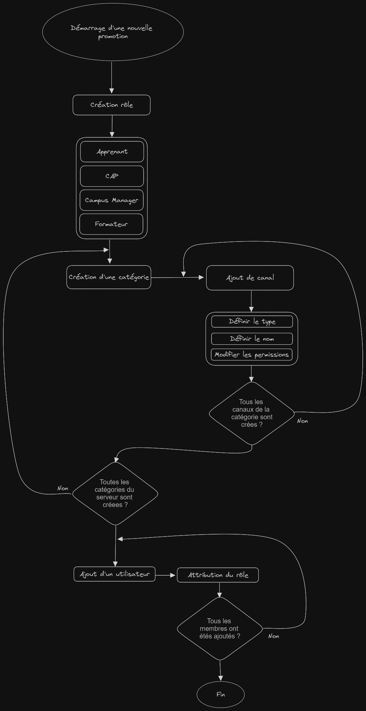

# Le client : Simplon

Dans ce projet, notre client était l'organisme de formation Simplon Hauts-de-France (Simplon HDF). Simplon HDF compte 21 000 apprenants et dispose de 7 fabriques numériques.

La communication est un enjeu majeur pour Simplon HDF, et le principal support de communication utilisé est Discord, qui permet les échanges entre les équipes et les apprenants.

## Contextualisation du projet : Discord Communautaire 

Dans le cadre de ce projet, nous nous sommes concentrés sur la manière dont Simplon HDF communique. En tant qu'apprenants, nous avons remarqué que les équipes de Simplon HDF effectuent des actions répétitives qui pourraient être automatisées facilement. De plus, la communication, notamment avec les apprenants, est fastidieuse.

C'est pourquoi notre équipe a réfléchi à des solutions pour remédier à ces problèmes.

Nous avons également discuté avec les membres des équipes Simplon afin de recueillir les problématiques auxquelles ils sont confrontés :

## Recueil des besoins du client 

Pour recueillir les besoins du client, notre équipe a d'abord discuté avec les différents membres des équipes Simplon. Suite à ces discussions, nous avons dressé une liste des problèmes les plus fréquemment rencontrés par les membres des équipes Simplon.

<table>
    <tr>
        <td>Problématiques</td>
        <td>Problèmes</td>
    </tr>
    <tr>
        <td rowspan="4">Utilisation inappropriée de Discord dans un cadre professionnel</td>
        <td>Multiplicité des supports de communication</td>
    </tr>
    <tr>
        <td>Mauvaise identification lors des interactions</td>
    </tr>
    <tr>
        <td>Actions répétitives du personnel</td>
    </tr>
    <tr>
        <td>Manque d'ergonomie de Discord</td>
    </tr>
    <tr>
        <td rowspan="4">Communication inefficace</td>
        <td>Multiplicité des messages inutiles (FLOOD)</td>
    </tr>
    <tr>
        <td>Perte de contact avec les anciens apprenants</td>
    </tr>
    <tr>
        <td>Pas de mentorat</td>
    </tr>
    <tr>
        <td>Problème de sourcing</td>
    </tr>
</table>

### Utilisation inappropriée de Discord dans un cadre professionnel

#### Multiplicité des supports de communication

Concernant ce problème, nos équipes ont constaté qu'il existait une multitude de serveurs Discord utilisés par les membres de Simplon pour communiquer avec différentes entités. Par exemple, un formateur peut avoir accès à 12 serveurs Discord réservés aux promotions auxquelles il participe, sans compter les autres serveurs nécessaires pour communiquer avec les équipes Simplon.

#### Mauvaise identification lors des interactions

Discord utilise nativement un système de pseudonymes, ce qui n'est pas adapté à une utilisation professionnelle où l'identification claire des utilisateurs est nécessaire. Cela peut entraîner des complications pour identifier les personnes avec lesquelles nous souhaitons communiquer via Discord.

#### Actions répétitives du personnel

Il a également été observé que les membres des équipes Simplon, en particulier les formateurs, effectuent de nombreuses actions répétitives. Par exemple, lors du démarrage d'une nouvelle promotion chez Simplon HDF, un formateur doit effectuer les étapes suivantes pour permettre aux apprenants de communiquer entre eux :

Et ces étapes doivent être répétées pour chaque nouvelle promotion dont le formateur est responsable.

#### Manque d'ergonomie de Discord

Les membres des équipes ont également exprimé leur malaise quant à l'utilisation de Discord, notamment dans un contexte professionnel. Ils ont relevé des lacunes ergonomiques qui rendent l'utilisation de Discord moins confortable.

### Communication inefficace

#### Multiplicité des messages inutiles

Il a également été remarqué que les apprenants ont tendance à envoyer des messages de rappel aux membres de l'équipe dans des situations où ils n'ont pas reçu de réponse à leurs sollicitations. Bien que cela puisse sembler anodin, cela génère des messages inutiles et constitue une source de distraction pour les membres des équipes.

#### Perte de contact avec les anciens apprenants

Certains membres des équipes Simplon nous ont fait part de la difficulté à maintenir le contact avec les anciens apprenants. En effet, dans la configuration actuelle de l'organisme de formation, il n'existe pas de solution concrète permettant de rester en contact avec les anciens apprenants. Une fois leur formation terminée, ils quittent le serveur Discord dédié à leur promotion, ce qui entraîne une perte de contact.

#### Problème de sourcing

Les membres ont également signalé des problèmes de sourcing. Selon eux, il est relativement difficile de trouver des profils correspondant aux critères des promotions et de les intégrer.

## L'équipe en charge du projet 

**BOURREZ Bastien** (surnom : le pro Discord)

**PHILIPPE Nelson** (surnom : l'aventurier)

**LEROY Cédric** (surnom : l'encyclopédie / rédacteur en chef)

**GAMACHE Benjamin** (surnom : moi-même)

## Proposition de solution : Discord vs. Application développée de zéro

Notre équipe s'est interrogée sur la meilleure solution entre l'utilisation de Discord et le développement d'une application spécifique pour Simplon.

Utiliser Discord présente les avantages suivants :

- Il est déjà utilisé par la majorité des membres des équipes et des apprenants.
- Il est gratuit.
- Il constitue déjà un support de communication stable.
- Il est flexible et adapté à tout type d'équipe de développement.

En revanche, développer une application spécifique impliquerait les éléments suivants :

- Imposer l'utilisation de l'application à tous les membres des équipes et apprenants.
- Ajouter un nouveau support de communication pour tous les utilisateurs.
- Engendrer des coûts en termes de graphisme.
- Nécessiter un hébergement de serveur plus important.
- Requérir des connaissances avancées dans certains langages de programmation.

C'est pourquoi nous avons choisi d'utiliser Discord plutôt que de développer une application à

partir de zéro.