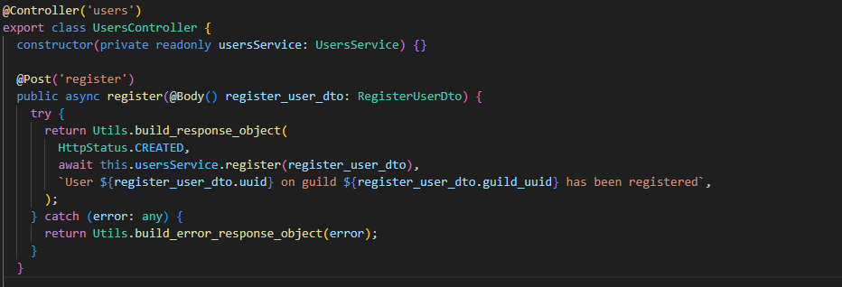

# Conception

Il n'existe aucune conception dédiée à l'API.

## CRUD (Create Read Update Delete)

Le CRUD est les 4 opérations d'une API qui permettent respectivement de

- Créer une ressource à l'aide de la Method HTTP POST
- Récupérer une ressource à l'aide de la Method HTTP GET
- Mettre à jour une ressource à l'aide de la Method HTTP PATCH / PUT
- Supprimer une ressource à l'aide de la Method HTTP DELETE

## NestJS & Express

Il est important de savoir que NestJS met en place le squelette pour le développeur et délègue la gestion des requêtes à Express ou Fastify (en l'occurence Express).

## Architecture de l'API : NestJS

NestJS est un framework qui permet par le biais du module CLI de créer des composants d'API de façon structuré.

```sh
$ nest g resource
```

Cette commande permet de générer un module qui se décompose comme le dossier 'users'


Qui comprends : 

- 1 Dossier portant le nom de la ressource
  - 1 Dossier DTO
  - 1 fichier de classe controller
    - 1 fichier de test du controller
  - 1 fichier de classe service
    - 1 fichier de test du service
  - 1 fichier de classe module

La commande génère un module CRUD.

Chaque module NestJS sera donc séparé de la même façon, cela permet de séparer chaque classe en fonction de leur utilisation.

## Le module : User

Les modules NestJS permette de définir les spécifications pour ce module.


On peut voir un décorateur Nest intitulé "Module" qui abstrait une grande quantité de code pour le développeur et qui est laissé à NestJS
Dans l'objet envoyé au décorateur, on peu observer certaines clés.

### La propriété Controllers

La clé controllers envoyé au décorateur est un taleau de type Type.
Avec la clé controllers, le développeur définit le (ou LES) controlleur(s) du module, de plus, le fait que cette clé soit un tableau de Type et non juste un Type permet de définir plusieurs controller pour un même module, et donc permet sur des projets de grande envergure de séparer les routes en fonctions de leur champ d'action, ce qui apporte une certaine clareté dans les fichiers de code.

### La propriété Providers

La clé providers quant à elle permet de définir les Providers du module, c'est à dire, les classes dont ce module (Ou le module l'important) utilise.
Provider signifie Fournisseur, on peut en comprendre que les Providers NestJS sont donc des fournisseurs de code.

## Autre propriétés du module

Il existe d'autre clés pour les modules, cependant nous n'en avons pas besoin dans notre cas.

## Le controlleur : User

Un controlleur permet de recevoir des requêtes HTTP et les traiter en appliquant la logique adaptée à la requête.

### Conventions d'écriture des controlleurs

J'ai décidé de standardiser la structure des controlleurs afin de permettre une lecture optimale du code, la structure que j'ai choisi est la suivante :

- Les routes POST
- Les routes GET
- Les routes DELETE
- Les routes UPDATE

De cette façon, chaque controlleur est construit de la même façon et il est facile de retrouver une route en particulier.

En plus de cet agencement du code, j'ai décidé d'écrire chaque méthode comme suit : 

```ts
scope async nomDeLaMethode(arguments) {}
```

Afin que n'importe qui puisse comprendre que la méthode est publique est en exécution asynchrone
De plus, j'ai adopté une convention de nommage qui abstrait le module dans lequel la méthode se trouve par exemple la méthode :

```ts 
getUserByUUID() {}
```
devient 
```ts 
getByUUID() {}
```

Puis-ce que la méthode se trouve dans le controlleur 'User' les méthodes n'ont pas besoin de spécifier que ces dernières se rapportent à l'utilisateur.
Il existe cependant des exceptions à cette convention, lorsque la route impliquera par exemple une logique qui ne correspond pas uniquement à l'utilisateur.

Par exemple, une route du controlleur qui implique une logique selon laquelle on cherche à récupérer les promotions liées à un utilisateur seront nommée de façon explicites :

```ts
getUserPromosByGuildUUID(guild_uuid: string) {}
```

Au premier coup d'oeil on comprends que la méthode sert à récupérer les promotions liées à l'utilisateur en fonction du UUID de la guilde passé en argument.

### Contenu des controlleurs

Le contenu de chaque méthode contient : 

- Un bloc de code Try-Catch
- 2 appels à une fonction de standardisation des réponses.

#### Le bloc Try-Catch

J'ai utilisé des Blocs Try Catch dans chaque controlleur pour permettre à l'éxecution de ne pas s'arrêter en cas d'erreur non gérée ou gérée, je m'explique.
La logique de chaque route peut renvoyer une erreur déclenchée volontairement afin de mettre fin au fil d'éxecution, pour l'instant, cela peut semler stupide, cependant nous verrons plus tard pourquoi j'ai designé les controlleurs de cette façon.

Amélioration à apporter : Globaliser les blocs de try catch au sein d'un middleware pour eliminer cette invasion.

#### Appelle à la fonction de normalisation des réponses

J'ai développé une méthode permettant de retranscrir les objets ressortis par la logique de façon uniforme.


On peut voir dans la méthode "build_response_object" que le code prends en paramètre :

- Un status code (Code HTTP de réponse à la requête)
- La donnée renvoyée suite à l'execution de la logique
- Le message à renvoyé suite à l'execution de la logique

Cette fonction se charge uniquement de "parser" toutes ces données en un objet JSON et de normaliser la sortie de chaque reponse.

De plus, on peut constater que les données passe dans une fonction qui exclues les champs ID des ojets retournés.

### La route POST



La route est caractérisée par la méthode ```register() {}``` on peut voir sur cette méthode un décorateur NestJS qui permet de définir que la méthode prendra en charge la requête HTTP vers la route "users/register" en Method HTTP POST.

Notez la présence du décorateur ```@Controller('users')``` qui permet de définir un préfix aux routes du controlleur.

On peut voir que dans les paramètres de cette route qu'il y'a un DTO (Data Transfer Object), il s'agit de la partie "Body" (ou "Payload" dans le cas d'une requete POST) des requêtes HTTP.

On retrouve dans le bloc Try Catch le retour de l'appelle du service dedié (la logique concernée) normalisé au client.

### La route GET


Ici encore la même construction que précedemment, sauf que l'on peut voir dans le décorateur ```@Get('guild/:guild_uuid')```.
Ici le ':' permet à NestJS de splitter et d'identifier les paramètres de la requête.

Comme on peut le voir en dessous dans les arguments de la méthode ```@Param('guild_uuid')``` NestJS sait qu'il doit attribuer la valeur du paramètre à cette variable en Runtime, il établit en quelques sorte qu'il remplace la valeur du paramètre en 'guild_uuid' et identifie qu'il s'agit de ce paramètre et attribue donc la valeur du paramètre à l'argument concerné.

#### Les routes DELETE & PATCH

La route delete n'a rien de particulier.


La route PATCH n'a rien de particulier.


### Les services

Les services NestJS sont les classes dans lesquelles toute la logique va être implentée.

#### Le service : User

##### Méthode d'enregistrement


Pour enregistrer un nouvel utilisateur Discord côté API, la méthode ```register() {}``` décrit la logique.

On stock d'abord la valeur de retour de l'appel de la méthode ```getByUUID() {}`` qui prends les mêmes paramètres et qui sert à récupérer un utilisateur enregistrée dans la base de donnée.

Si la valeur de la variable ```targeted_user``` est indéfini, cela veut dire que l'utilisateur n'existe pas, alors on peut demander à Prisma de le créer et la méthode retournera l'objet crée (en plus de certaines autres données) au controlleur.

Si l'utilisateur est déjà enregistré alors on coupe le fil d'exécution en déclenchant une erreur et le controlleur renvoit le message d'erreur adapté.

#### Méthode de récupération par UUID


Dans la méthode de récupération, on stock l'utilisateur récupéré dans une variable par le biais de Prisma.
Notez que l'on demande à Prisma de récupérer l'utilisateur en fonction de son identifiant unique mais aussi de l'identifiant unique de la guild (Serveur Discord)

En invoquant la methode de récupération de Guild par son UUID, on permet en fait au code de retourner une erreur dans le cas où la guild n'existe pas.
Et donc de renvoyer le message d'erreur : "La Guild spécifiée n'existe pas"

Si tout se passe bien, on renvoit l'utilisateur.

#### Methode de suppression & Methode de mise à jour


Rien de particulier à ajouter sur ces méthodes, mais elles existent.

#### This.includedValues() ?

.PNG)

Il s'agit seulement d'une méthode permettant de définir ce que les objets de retours vont inclures.

En l'occurence, on demande à Prisma d'inclure la Guild (son UUID ici) d'un User lorsqu'il le récupère.
On centralise seulement les ressources nested au sein d'une seule et même méthode.

### DTO ?

Le DTO ou Data Transfer Object est un type de classe mis en place avec NestJS qui permet de formater un objet JSON voici un exemple : 


NestJS met en place cette fonctionnalité afin de structurer les données reçues dans la requête.
De plus le système de DTO permet d'exécuter une vérification préalable à l'exécution de la logique.

Le décorateur ```@IsString()``` en est un bon exemple, il permet de vérifier que cette clé dans les objets de la requête correspondent aux types décrit dans le DTO.
Il existe d'autre décorateur de vérification.
Chaque décorateur de vérification permet de définir un message d'erreur spécifique.

## Swagger

Swagger est un outil permettant de mettre en place une documentation de l'API, il permet de décrire chaque route, ses paramètres, ses données attendues.
Nous avons utilisé Swagger pour documenter notre API, bien qu'elle ne soit pas complète elle apporte une vue d'ensemble sur l'architecture de l'API.

