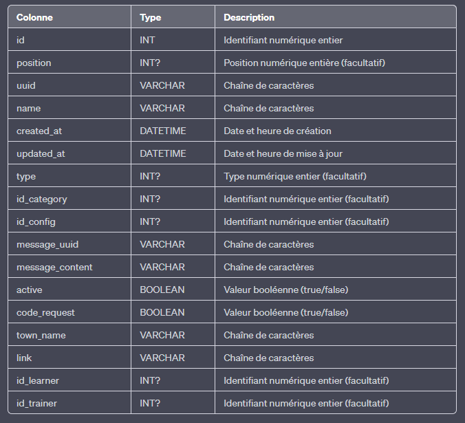
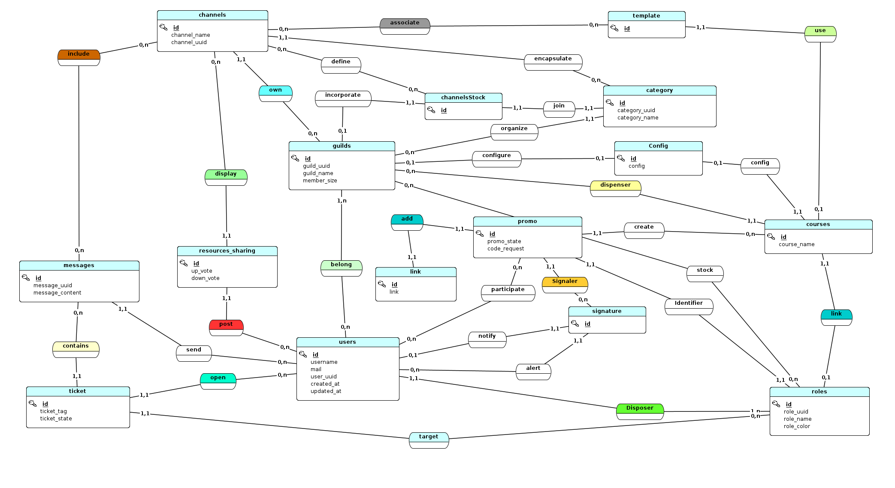

# La base de donnée

## Conception de la base de donnée

Pour la conception de notre base de donnée, nous avons utilisé l'outil JMerise

### Dictionnaire de donnée

Le dictionnaire de donnée est un recueil de toutes les clés d'une base de donnée, le dictionnaire de donnée est la première étape préalable à la conception d'une base de donnée, il servira de référentiel lors de la conception afin d'évaluer quelles clés vont dans quelles tables

Le dictionnaire de donnée pour notre application est le suivant : 

### Merise

Merise est une méthode d'analyse permettant la conception et la visualisation d'une base de donnée, le MCD est réalisé grace à l'appui du Dictionnaire de donnée

### MCD (Modèle Conceptuel de Donnée)

Le modèle conceptuel de donnée permet de visualiser les différentes entités (table) d'une base de donnée, il permet de définir les relations entre ces tables, les cardinalités de ces relations et donc d'établir un vue d'ensemble sur le base de donnée.

