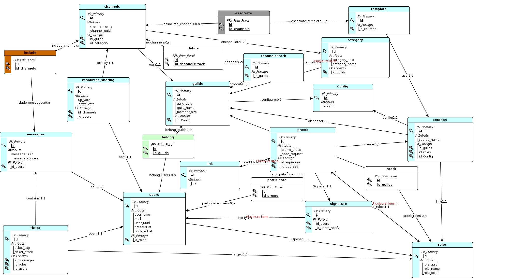

# La base de donnée

## Conception de la base de donnée

Pour la conception de notre base de donnée, nous avons utilisé l'outil JMerise

### Formes Normales

Les formes Normales sont une liste de critères qu'une base de donnée doit remplir afin d'être considéré comme performantes voici la liste des formes normales que notre base de donnée respectent : 

- 1NF : Clé primaire (Pas de doublon)
- 2NF : Valeurs atomiques (Chaque cellule qui compose une table est une unité indivisible)
  Exemple : Une adresse est divisible par un numéro, un nom de rue, une ville et un code postale.
  Pour respecter la 2ème forme normale, on créer une table adresse qui décompose ces différents champs.
- 3NF : (Les champs d'une table correspondent à une seule et unique clé primaire)
  Exemple :
  Les champs : Numéro de Commande, Adresse de livraison, Client, Produit dans une table Commande sont uniquement dépendant de la clé primaire "Numéro de Commande"

### Dictionnaire de donnée

Le dictionnaire de donnée est un recueil de toutes les clés d'une base de donnée, le dictionnaire de donnée est la première étape préalable à la conception d'une base de donnée, il servira de référentiel lors de la conception afin d'évaluer quelles clés vont dans quelles tables

Le dictionnaire de donnée pour notre application est le suivant : 


### Merise

Merise est une méthode d'analyse permettant la conception et la visualisation d'une base de donnée, il s'agit de la version UML de la base donnée, bien qu'on ne parle pas ici de diagramme même si les Modèles que Merise met en place y ressemble.

#### Les cardinalités

Les cardinalités sont les synonimes des multiplicités d'UML, elle permettent d'identifier les relations entre les différentes entités du décrite dans le MCD, il y'a différents type de cardinalités : 

0, 1 : Au minimum 0, au maximum 1 (On parle ici de CIF)
1, 1 : Au minimum 1, au maximum 1 (On parle ici aussi de CIF)
0, n : Au minimum 0, au maximum plusieurs valeurs (n représente ici un entier variable)
1, n : Au minimum 0, au maximum plusieurs valeurs

#### CIF et CIM

Parlons dans un premier temps de la CIF (Contrainte d'Intégrité Fonctionnelle) on parle d'une association CIF lorsque cette dernière est strictement fonctionnelle, c'est à dire que l'une des 2 entités associées par cette relation dépends de l'autre, sans l'une de ces 2 entités, l'autre n'existe pas.

La CIF ne se traduit pas par une nouvelle entitée, elle permettra seulement d'exporté la clé primaire d'une entitée dans l'autre au moment du passage en MPD / MLD, cette clé primaire deviendra alors une clé étrangère dans sa table d'accueil (Foreign Key). 

Voyons maintenant la CIM (Contrainte d'Intégrité Multiple) une CIM se caractérise par une relation dont les cardinalités sont soit 0, n soit 1 / n, la CIM représente un couple unique auquel on peut affecter des propriétés particulières. Une CIM est constitué des clés auxquelles elle est liée.

De plus, une CIM se traduit par une nouvelle entité lors du passage en MPD / MLD

#### MCD (Modèle Conceptuel de Donnée)

Le Modèle Conceptuel de Donnée permet de visualiser les différentes entités (table) d'une base de donnée, il permet de définir les relations entre ces tables, les cardinalités de ces relations et donc d'établir un vue d'ensemble sur le base de donnée.

Dans le MCD, nous définissons les différentes clés des différentes entités décrite par le dictionnaire de donnée, et relions ces différentes entités par des relations comprennant des cardinalités qui permettent de définir le type de relation entre les entités.


Un exemple de CIF concret est la relation "configure" entre l'entité Guilds et l'entité "Config" du MCD
Un exemple contret de CIM est la relation "participate" entre l'entitée "Users" et l'entité "Promo"

#### MLD (Modèle Logique de Donnée)

Le Modèle Logique de Donnée est une retranscription plus proche de la mise en place de la Base de donnée, on ne parle plus d'entité, mais de table.
Le MLD permet de représenter la façon dont sera agencée chaque table de la base de donnée avec les clés primaires et les foreign key dans les différentes table.

Les CIM du MCD se transforment en table dans le MLD.



#### MPD (Modèle Physique de Donnée)

Le Modèle Logique de Donnée retranscrit le MLD en instructions SQL, qui permettra de générer la Base de Donnée conceptualisée en Base de Donnée réelle.
Voici le MPD de notre Base de Donnée : 

```sql
CREATE TABLE "Category" (
  "id" SERIAL PRIMARY KEY,
  "id_guild" INTEGER NOT NULL,
  "position" INTEGER,
  "uuid" VARCHAR(255) NOT NULL,
  "name" VARCHAR(255) NOT NULL,
  "created_at" TIMESTAMP DEFAULT NOW(),
  "updated_at" TIMESTAMP DEFAULT NOW(),
  "channelsStockId" INTEGER,
  "promoId" INTEGER,
  FOREIGN KEY ("id_guild") REFERENCES "Guild" ("id") ON DELETE CASCADE,
  FOREIGN KEY ("channelsStockId") REFERENCES "ChannelStock" ("id") ON DELETE SET NULL,
  FOREIGN KEY ("promoId") REFERENCES "Promo" ("id") ON DELETE SET NULL
);

CREATE TABLE "Channel" (
  "id" SERIAL PRIMARY KEY,
  "name" VARCHAR(255) NOT NULL,
  "uuid" VARCHAR(255) UNIQUE NOT NULL,
  "type" INTEGER NOT NULL,
  "position" INTEGER NOT NULL,
  "id_guild" INTEGER NOT NULL,
  "id_category" INTEGER,
  "created_at" TIMESTAMP DEFAULT NOW(),
  "updated_at" TIMESTAMP DEFAULT NOW(),
  FOREIGN KEY ("id_guild") REFERENCES "Guild" ("id") ON DELETE CASCADE,
  FOREIGN KEY ("id_category") REFERENCES "Category" ("id") ON DELETE SET NULL
);

CREATE TABLE "Config" (
  "id" SERIAL PRIMARY KEY,
  "config" JSON,
  "guildId" INTEGER,
  "courseId" INTEGER UNIQUE,
  FOREIGN KEY ("guildId") REFERENCES "Guild" ("id") ON DELETE SET NULL,
  FOREIGN KEY ("courseId") REFERENCES "Course" ("id") ON DELETE SET NULL
);

CREATE TABLE "Course" (
  "id" SERIAL PRIMARY KEY,
  "name" VARCHAR(255) NOT NULL,
  "id_role" INTEGER UNIQUE NOT NULL,
  "id_guild" INTEGER NOT NULL,
  "id_config" INTEGER UNIQUE,
  "created_at" TIMESTAMP DEFAULT NOW(),
  "updated_at" TIMESTAMP DEFAULT NOW(),
  FOREIGN KEY ("id_role") REFERENCES "Role" ("id") ON DELETE CASCADE,
  FOREIGN KEY ("id_guild") REFERENCES "Guild" ("id") ON DELETE CASCADE,
  FOREIGN KEY ("id_config") REFERENCES "Config" ("id") ON DELETE SET NULL
);

CREATE TABLE "Guild" (
  "id" SERIAL PRIMARY KEY,
  "uuid" VARCHAR NOT NULL,
  "name" VARCHAR(50) NOT NULL,
  "member_count" INTEGER NOT NULL,
  "config_id" INTEGER UNIQUE,
  "created_at" TIMESTAMP DEFAULT NOW(),
  "updated_at" TIMESTAMP DEFAULT NOW(),
  FOREIGN KEY ("config_id") REFERENCES "Config" ("id") ON DELETE SET NULL
);

CREATE TABLE "Link" (
  "id" SERIAL PRIMARY KEY,
  "link" VARCHAR(50) NOT NULL,
  "created_at" TIMESTAMP DEFAULT NOW(),
  "updated_at" TIMESTAMP DEFAULT NOW()
);

CREATE TABLE "Message" (
  "id" SERIAL PRIMARY KEY,
  "message_uuid" VARCHAR NOT NULL,
  "message_content" VARCHAR(255) NOT NULL,
  "id_user" INTEGER NOT NULL,
  "id_ticket" INTEGER,
  "created_at" TIMESTAMP DEFAULT NOW(),
  "updated_at" TIMESTAMP DEFAULT NOW(),
  FOREIGN KEY ("id_user") REFERENCES "User" ("id") ON DELETE CASCADE,
  FOREIGN KEY ("id_ticket") REFERENCES "Ticket" ("id") ON DELETE CASCADE
);

CREATE TABLE "Promo" (
  "id" SERIAL PRIMARY KEY,
  "name" VARCHAR NOT NULL,
  "active" BOOLEAN NOT NULL,
  "code_request" BOOLEAN DEFAULT true,
  "id_course" INTEGER NOT NULL,
  "id_role" INTEGER UNIQUE NOT NULL,
  "id_factory" INTEGER NOT NULL,
  "id_category" INTEGER UNIQUE NOT NULL,
  "created_at" TIMESTAMP DEFAULT NOW(),
  "updated_at" TIMESTAMP DEFAULT NOW(),
  FOREIGN KEY ("id_course") REFERENCES "Course" ("id") ON DELETE CASCADE,
  FOREIGN KEY ("id_role") REFERENCES "Role" ("id") ON DELETE CASCADE,
  FOREIGN KEY ("id_factory") REFERENCES "Factory" ("id") ON UPDATE NO ACTION,
  FOREIGN KEY ("id_category") REFERENCES "Category" ("id") ON DELETE CASCADE
);

CREATE TABLE "Factory" (
  "id" SERIAL PRIMARY KEY,
  "town_name" VARCHAR(255) NOT NULL,
  "id_guild" INTEGER NOT NULL,
  "id_role" INTEGER UNIQUE,
  "created_at" TIMESTAMP DEFAULT NOW(),
  "updated_at" TIMESTAMP DEFAULT NOW(),
  FOREIGN KEY ("id_guild") REFERENCES "Guild" ("id") ON DELETE CASCADE,
  FOREIGN KEY ("id_role") REFERENCES "Role" ("id") ON DELETE CASCADE
);

CREATE TABLE "resources_sharing" (
  "id" SERIAL PRIMARY KEY,
  "up_vote" INTEGER NOT NULL,
  "down_vote" INTEGER NOT NULL,
  "id_channel" INTEGER NOT NULL,
  "id_user" INTEGER NOT NULL,
  "created_at" TIMESTAMP DEFAULT NOW(),
  "updated_at" TIMESTAMP DEFAULT NOW(),
  FOREIGN KEY ("id_channel") REFERENCES "Channel" ("id") ON DELETE NO ACTION,
  FOREIGN KEY ("id_user") REFERENCES "User" ("id") ON DELETE NO ACTION
);

CREATE TABLE "Role" (
  "id" SERIAL PRIMARY KEY,
  "uuid" VARCHAR NOT NULL,
  "name" VARCHAR(255) NOT NULL,
  "color" VARCHAR(20) NOT NULL,
  "position" INTEGER NOT NULL,
  "id_guild" INTEGER NOT NULL,
  "courseId" INTEGER,
  "promoId" INTEGER,
  "factoryId" INTEGER,
  "created_at" TIMESTAMP DEFAULT NOW(),
  "updated_at" TIMESTAMP DEFAULT NOW(),
  FOREIGN KEY ("id_guild") REFERENCES "Guild" ("id") ON DELETE CASCADE,
  FOREIGN KEY ("courseId") REFERENCES "Course" ("id") ON DELETE NO ACTION,
  FOREIGN KEY ("promoId") REFERENCES "Promo" ("id") ON DELETE CASCADE,
  FOREIGN KEY ("factoryId") REFERENCES "Factory" ("id") ON DELETE CASCADE
);

CREATE TABLE "Signature" (
  "id" SERIAL PRIMARY KEY,
  "id_learner" INTEGER,
  "id_trainer" INTEGER,
  "created_at" TIMESTAMP DEFAULT NOW(),
  "updated_at" TIMESTAMP DEFAULT NOW(),
  FOREIGN KEY ("id_learner") REFERENCES "User" ("id") ON DELETE NO ACTION,
  FOREIGN KEY ("id_trainer") REFERENCES "User" ("id") ON DELETE NO ACTION
);

CREATE TABLE "Template" (
  "id" SERIAL PRIMARY KEY,
  "id_course" INTEGER NOT NULL,
  "id_channel" INTEGER NOT NULL,
  "created_at" TIMESTAMP DEFAULT NOW(),
  "updated_at" TIMESTAMP DEFAULT NOW(),
  FOREIGN KEY ("id_course") REFERENCES "Course" ("id") ON DELETE CASCADE,
  FOREIGN KEY ("id_channel") REFERENCES "Channel" ("id") ON DELETE CASCADE
);

CREATE TABLE "Ticket" (
  "id" SERIAL PRIMARY KEY,
  "ticket_tag" VARCHAR(255) NOT NULL,
  "ticket_state" VARCHAR NOT NULL,
  "id_user" INTEGER NOT NULL,
  "id_message" INTEGER,
  "created_at" TIMESTAMP DEFAULT NOW(),
  "updated_at" TIMESTAMP DEFAULT NOW(),
  FOREIGN KEY (id_user) REFERENCES User (id) ON DELETE CASCADE,
  FOREIGN KEY (id_message) REFERENCES Message (id) ON DELETE CASCADE
);

CREATE TABLE IF NOT EXISTS "User" (
  "id" SERIAL PRIMARY KEY,
  "username" VARCHAR(255),
  "mail" VARCHAR(255),
  "uuid" VARCHAR(255),
  "id_guild" INT,
  "created_at" TIMESTAMP DEFAULT NOW(),
  "updated_at" TIMESTAMP,
  FOREIGN KEY ("id_guild") REFERENCES "Guild" ("id") ON DELETE CASCADE
);

CREATE TABLE "ChannelStock" (
  "id" SERIAL PRIMARY KEY,
  "id_guild" INT UNIQUE,
  "id_category" INT UNIQUE,
  FOREIGN KEY ("id_guild") REFERENCES "Guild" ("id") ON DELETE CASCADE ON UPDATE NO ACTION,
  FOREIGN KEY ("id_category") REFERENCES "Category" ("id"),
  CONSTRAINT "channelsStock_guilds_fk" FOREIGN KEY ("id_guild") REFERENCES "Guild" ("id") ON DELETE CASCADE ON UPDATE NO ACTION,
  CONSTRAINT "channelsStock_category_fk" FOREIGN KEY ("id_category") REFERENCES "Category" ("id")
);

CREATE TABLE "Define" (
  "id" INT,
  "id_channelsStock" INT,
  FOREIGN KEY ("id") REFERENCES "ChannelStock" ("id") ON DELETE NO ACTION ON UPDATE NO ACTION,
  FOREIGN KEY ("id_channelsStock") REFERENCES "ChannelStock" ("id") ON DELETE NO ACTION ON UPDATE NO ACTION,
  CONSTRAINT "define_channels_fk" FOREIGN KEY ("id") REFERENCES "Channel" ("id") ON DELETE NO ACTION ON UPDATE NO ACTION,
  CONSTRAINT "define_channelsStock_fk" FOREIGN KEY ("id_channelsStock") REFERENCES "ChannelStock" ("id") ON DELETE NO ACTION ON UPDATE NO ACTION,
  PRIMARY KEY ("id", "id_channelsStock")
);

CREATE TABLE "Participants" (
  "id" SERIAL PRIMARY KEY,
  "id_promo" INT,
  "user_id" INT,
  FOREIGN KEY ("user_id") REFERENCES "User" ("id") ON DELETE CASCADE,
  FOREIGN KEY ("id_promo") REFERENCES "Promo" ("id") ON DELETE CASCADE,
  CONSTRAINT "participate_user_fk" FOREIGN KEY ("user_id") REFERENCES "User" ("id") ON DELETE CASCADE,
  CONSTRAINT "participate_promo_fk" FOREIGN KEY ("id_promo") REFERENCES "Promo" ("id") ON DELETE CASCADE
);

```