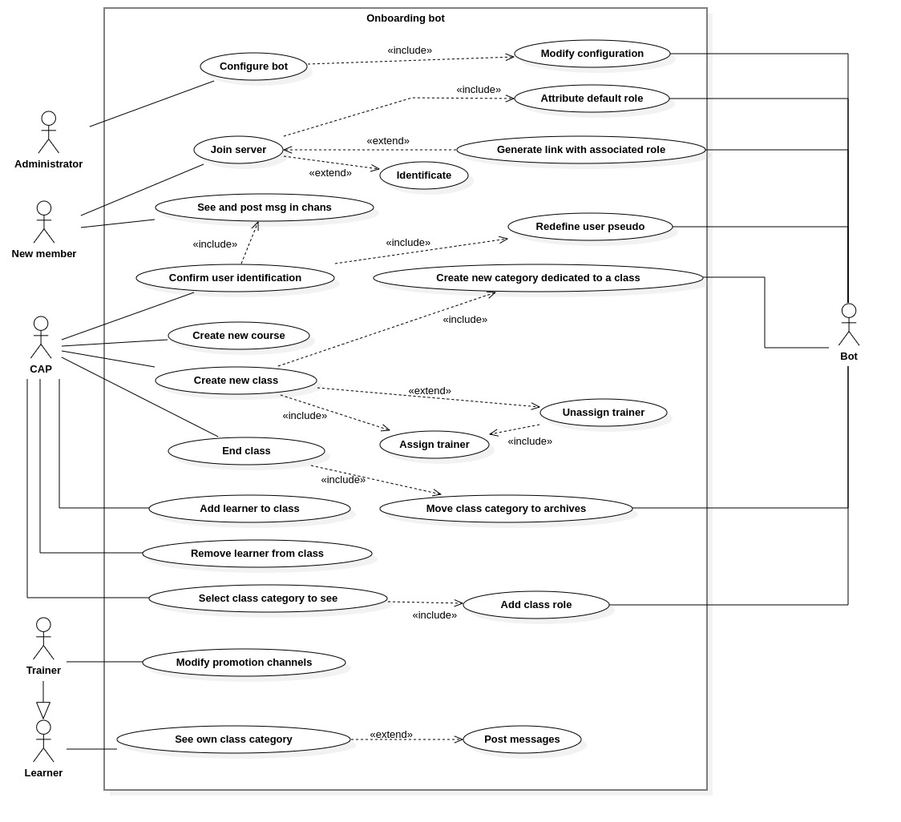
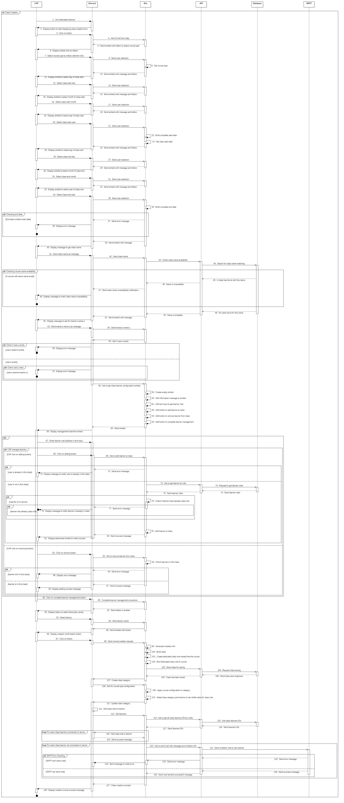
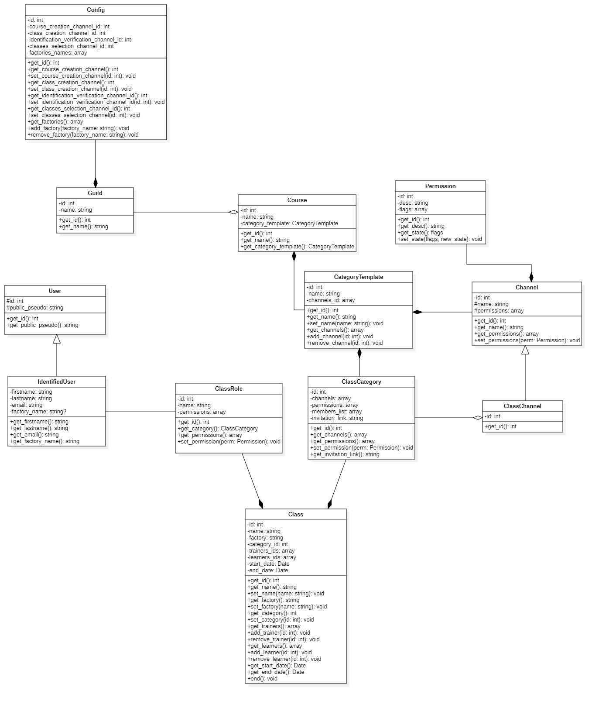

# Bot Onboarding

# Contexte

Le Bot d'Onboarding doit permettre de gérer de façon globale l'import d'un éco-système de Centre de Formation au sein d'un seul et unique serveur Discord, dans cette optique, le Bot doit permettre d'accueillir de nouveaux membres internes ou externes au Centre de Formation.

Il doit permettre de définir qu'un utilisateur est un Apprenant ou un Membre des différentes équipes du Centre de Formation de la façon la plus simple possible, pour permettre l'accueil des différentes promotions, le Bot doit mettre à disposition un espace dédié à une promotion.

Aussi, le Bot doit permettre la création de nouvelles formations ainsi que la création de nouvelles promotions de façon la plus simple possible, il doit aussi permettre aux membres concernés de consulter ces différents espaces si nécessaire tout en conservant une navigation fluide au sein du serveur Discord

## Conception

### UML (Unified Modeling Language)

UML est un langage de modelisation utilisé pour modéliser des processus commerciaux ou analyser, concevoir et implementer des composants logiciels

Le langage UML est un standard à suivre quant à la conception d'une application, nous avons utilisé UML afin de concevoir notre application de façon globale.
Dans lequel chaque diagramme apporte une vision différente de l'application, chaque diagramme est important est peut-être pris indépendemment des autres, il s'agit d'une ligne directrice à suivre lors de l'étape de réalisation d'une application.

### Use Case (Diagramme de cas d'utilisation) : Zoom x1 

Le diagramme de cas d'utilisation d'une application permet aux développeurs de comprendre :

- Quels sont les acteurs impliqué au sein du système
- Quels sont les utilisations possible du système par ces acteurs
- Quels sont les intéractions entre ces acteurs

Il apporte une vue d'ensemble et très peu détaillée de l'application, cependant il est nécessaire d'établir une diagramme de cas d'utilisation correcte afin de construire les autres diagrammes qui rentront plus en profondeur dans les cas d'utilsation de l'application.

Dans ce présent diagramme :

L'administrateur (représenté ici par Administrator) peut configurer le Bot ce qui implique que le Bot modifie sa configuration.

Un nouveau membre (représenté ici par New Member) peut rejoindre le serveur ce qui implique que le Bot lui attribut un rôle par défaut, aussi, il est possible que le Bot ait généré un lien d'invitation auquel il a associé un rôle à attribué à l'utilisateur. Aussi, le nouveau membre peut ou doit s'identifier selon le lien d'invitation avec lequel il a rejoint le serveur Discord.

Le nouveau membre peut poster des messages dans les canaux globaux, et il peut poster des messages dans les canaux liés à son rôle ce qui implique, qu'il se soit identifié.

Le CAP peut confirmer les demandes d'identification des nouveaux membres, ce qui implique que le Bot doivent redéfinir le pseudo du nouvel utilisateur, le cap peut aussi créer un nouveau type de formation, il peut créer une nouvelle promotion, il doit pour cela assigner au moins un formateur à la promotion, pour créer une nouvelle promotion le Bot doit créer un espace dédié à la promotion.

Le CAP peut aussi mettre fin à un promotion en cours, ce qui implique que le Bot doit déplacer la catégorie liée à la promotion vers une zone d'archivage, le cap peut aussi ajouter ou supprimer un apprenant d'une promotion. Il peut aussi selectionner les promotions qu'il veut consulter ce qui implique que le Bot doit ajouter ou retirer un rôie au CAP.

Le formateur (représenté ici par Trainer) peut quant à lui consulter l'espace dédié à sa promotion et y discuter librement. L'apprenant (représenté ici par Learner) peut lui aussi consulter son espace de formation et y discuter librement.

### Activity Diagram (Diagramme d'Activités) : Zoom x2 

Le diagramme d'activités représente les différentes activités d'une application de façon générale et peu détaillée, il est conçu à partir du diagramme de cas d'utilisation

Il apporte cependant une meilleure visibilité quant au flux d'exécution des actions.

#### Création d'une nouvelle promotion

Ce présent diagramme décrit les activités possibles lors de la création d'une nouvelle promotion :

Un CAP rejoint le canal dédié à la création d'une promotion, Discord affiche donc un bouton afin de donner au CAP une interface de création de promotion. Le CAP clique sur le bouton et entre les différentes caractéristiques de la promotion puis valide la demande de création de promotion. Le Bot vérifie les informations entrées par le CAP, si une erreur est detectée, il le notifie au CAP¨, sinon le Bot récupère le template du type de formation, puis il créer un rôle de promotion ainsi qu'une catégorie (un espace) dédié à la promotion à laquelle il lie un lien d'invitation. Il attribue le rôle de promotion au CAP qui a crée la promotion. Alors Discord applique le template de formation à la catégorie de la promotion et lie le rôle de promotion à la catégorie. Ensuite le Bot va lié le rôle de promotion à chaque apprenant. Enfin Discord va notifier le succès de la création de la promotion au CAP

Utilisateur rejoignant le serveur

#### Diagramme de Séquence : Zoom x3

Le diagramme de séquence représente les différentes activités d'une application de façon très détaillée, il est conçu à partir du diagramme d'activités

#### Diagramme de Classe : Zoom x4

Le diagramme de classe représente les différentes classes d'une application, ce diagramme doit être utilisé lors de la phase de développement afin de permettre aux développeurs de savoir la façon dont doit être développer l'application.

Dans ce diagramme nous avons une classe nommé Config qui est utile afin de configurer le Bot, elle compose la classe Guild qui représente le Serveur Discord qui aggrege une la classe Course qui représente une formation.

La classe CategoryTemplate compose cette même classe Course et représente la façon dont doit-être agencé une catégorie Discord selon son type de Course (Formation) La classe Course représente une formation La classe ClassCategory compose la classe CategoryTemplate et est l'instanciation de la classe CategoryTemplate La classe ClassCategory aggrère la classe ClassChannel qui est l'instanciation des canaux pour la promotion La classe ClassChannel généralise (hérite) de la classe Channel qui est la représentation d'un canal Discord La classe Permission compose la classe Channel, cette classe permet de définir les permissions des différents rôles selon le canal Discord La classe ClassCategory compose la classe Class qui représente une promotion dans son ensemble La classe ClassRole compose elle aussi la classe Class, elle représente le rôle associé à chaque promotion La classe ClassRole est associé à la classe IdentifiedUser qui représente un utilisateur identifié sur le serveur Discord La classe IdentifiedUser généralise (hérite) User qui représente un utilisateur lambda