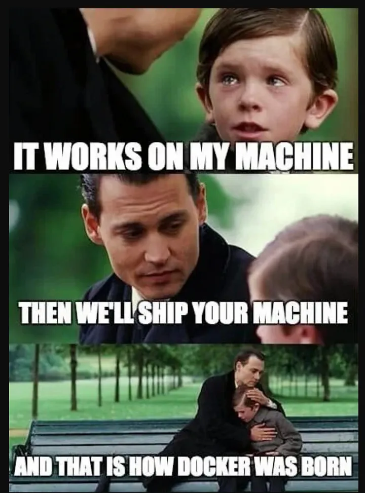
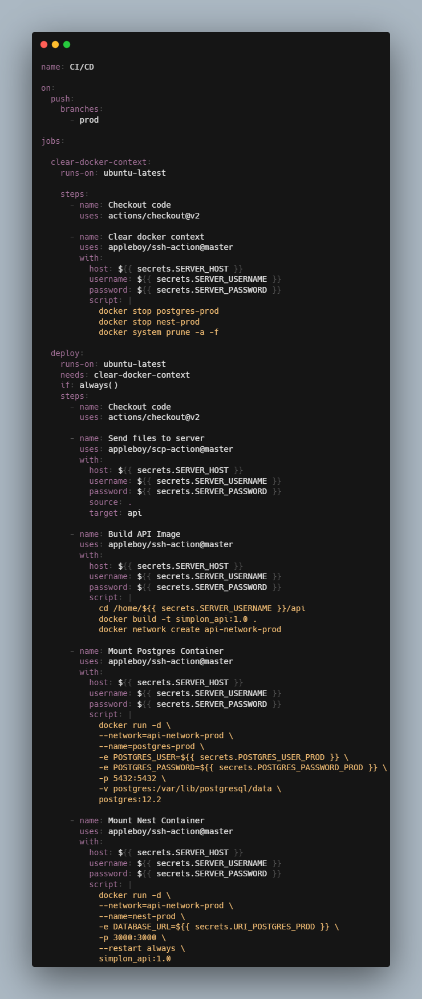
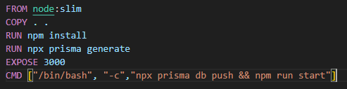

# Deploiement

## Docker



L'utilisation première de Docker réponds à une prolèmatique, l'environnement d'exécution.
En effet, il est courant d'entendre un développeur (j'en ai fais partie) dire que son application fonctionne sur sa machine, mais lors du déploiement de l'application, les clients rencontrent des problèmes d'exécution, de dépendance.

Docker permet d'installer n'importe quel environnement d'exécution dans ce qu'on appelle des conteneurs qui permettront d'avoir un environnement absolument identique en tout point entre la version de l'application en phase de test et l'application en phase de livraison, voilà à quoi sert Docker.

Docker apporte une couche de sécurité supplémentaire en compartimentant chaque conteneur bien distinctement des autres, les conteneurs ne peuvent pas communiquer entre eux (sauf dans des cas spécifique dans lesquels il est possile de faire communiquer des conteneurs) ce qui apporte une isolation parfaite des composants systèmes.

Par exemple, si une API se trouve dans un conteneur et qu'une base de donnée se trouve dans un autre, ces 2 composants ne communiquent pas directement entre eux, il sont séparés dans des conteneurs.

Un conteneur n'est PAS une Machine Virtuelle :


## GitHub Actions

Afin de deployer notre application nous avons utilisé GitHub Actions.
Nous étions limiter en terme de ressources serveurs et avions 2 serveurs VPS pour heberger notre application, il existe donc 2 CI/CD pour notre application.
Le découpage que j'ai décider d'adopter pour notre application est le suivant : 

- L'api et la base de donnée sur 1 serveur
- Le Bot d'Onboarding et Reddis sur 1 serveur

### La Pipeline CI / CD (Continueous Integration & Continueous Deployement) de l'API



Cette pipeline assure que l'application sera déployée à chaque fois que des modifications sont apportées sur la branche Prod (Lors de Merge suite à une pull request par exemple)

Voici dans l'ordre ce que fais ce script YAML : 

- Nettoyage de contexte Docker distant : 

Lors de la mise en place de cette pipeline, j'ai rencontré un problème, chaque déploiement que j'effectué rajouter une image Docker et donc prennez de l'espace Disque, si bien qu'à un moment, ma base de donnée ne pouvait plus écrire.

Je ne comprennais pas d'où venait le problème, bien que Postgres me disait qu'il manquait d'espace et que j'ai constaté que le Disque était saturé à l'aide de la commande (mf -H) pour obtenir des informations sur l'espace de stockage, je n'avais pas fais le lien entre Docker et l'espace Disque.

J'ai fini par débugger en utilisant cherchant méticuleusement quels dossier prennait de la place et ait compris que cela venait de docker.
J'ai alors rajouter ce Job dans ma CI / CD afin de supprimer toutes les images à chaque déploiement.

- Envoie des fichiers sources au serveur distant
- Construction de l'image de l'application : 

Cette étape consiste à créer l'image de l'application par le bais du DockerFile



Ce DockerFile installe une image de base (Node:lts-slim).
Ensuite on copie la racine (L'endroit ou se trouve le DockerFile) à la racine du futur conteneur (monté à partir de cette image).
On execute l'instruction ```npm install``` afin de faire installer les dépendances du projet dans l'image.
On genere les migrations à partir du schema prisma à l'aide de l'instruction ```npx prisma generate``` ce qui permet de synchroniser la base de donnée avec le Schéma Prisma.
On expose le port 3000 du futur conteneur (monté à partir de l'image que l'on construit) afin de permettre la consommation de cette API depuis l'exterieur
Et enfin on lance l'API à l'aide de l'instruction ```CMD .. npm run start```.

Une fois que l'image est construite plus qu'à la monter.

- Montage de l'image Postgres : 

L'image n'existe jamais locallement donc Docker la télécharge et la monte

- Montage de l'image de l'API : 

L'image à été construire en local, on la lance dans un conteneur.

Et voilà, l'application est deployée !